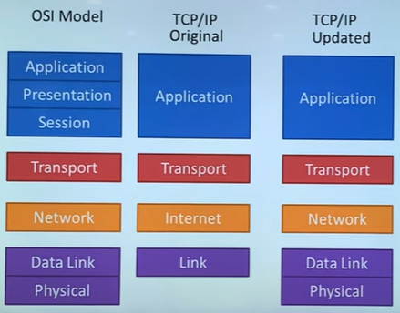

# 테코톡으로 보는 네트워크 OSI 7 Layer

[[10분 테코톡] 🔮 히히의 OSI 7 Layer - YouTube](https://www.youtube.com/watch?v=1pfTxp25MA8)

## 1. Physical Layer

컴퓨터와 컴퓨터 간 통신을 위해, 0과 1을 송수신 할 수 있으면 된다.

전선을 연결해서 보내면 안될까?

전자기파(파동)을 보내고 싶은데, 전선은 특정 주파수 영역 범위만 전송할 수 있다.

즉, 0 1 0 1 ... 의 형태, 계단식 파동(디지털 신호)은 0에서 무한대의 주파수를 갖기 때문에 전송할 수 없다.

때문에, 이를 아날로그 신호로 바꿔서 보낸 후, (encoding)

아날로그 신호를 받은 쪽은 디지털 신호로 해석해야 한다. (decoding)

- 이를 가능케 하는 모듈(module)이 곧 Physical Layer

- PHY 칩 (1계층 모듈은 HW적 구현)

- 누구에게 이 신호를 보낼지는 "스위치"라는 컴퓨터가 수행함

한 스위치 아래 연결된 여러 컴퓨터들 -> 한 네트워크에 있음.

스위치와 스위치를 연결해서 서로 다른 네트워크에 있는 컴퓨터끼리 통신이 가능해지게 하는 것 -> "라우터" (스위치와 라우터의 역할을 동시에 하는 장비로 대체)

-> 공유기

- 라우터와 라우터를 라우터로 연결하고, 또 라우터로 연결하면... -> 인터넷이 된다.

## 2. Data-Link Layer

여러 대의 컴퓨터가 통신하기 위해서?

0101 이라는 데이터를 송신하기 위해

앞에 1111, 뒤에 0000을 붙여보자 (Framing) -> 1111 0101 0000

자 그럼 여러 컴퓨터가 송신한 정보를 구분자로 정확히 끊어 읽을 수 있다.

- 같은 네트워크에 여러개의 컴퓨터들이 데이터를 주고받기 위해 필요한 모듈이 Data-link Layer

송신측)

2계층 encoder가 framing한다

1계층 encoder가 아날로그화 한다

수신측)

1계층 decoder가 디지털화 한다

2계층 decoder가 읽는다

- 랜카드 (2계층 모듈도 HW적 구현)

## 3. Network Layer

- 수많은 네트워크들의 연결인 inter-network 속에서 목적 컴퓨터로 전송하기 위해,

- IP 주소를 이용해 길을 찾고 (routing)

- 자신 다음의 라우터에게 데이터를 넘겨주는 것 (forwarding)

송신측)

3계층 encoder가 '데이터' 앞에  '목적 IP주소'를 붙여 구조체로 만든다 

2계층 - 1계층

수신측) (라우터)

1계층 - 2계층

3계층 decoder

다시 다음 라우터로 보내기 위해 3계층 encoder - 2계층 - 1계층 -> 다음 수신측에게 전달

- 운영체제의 커널에 SW적으로 구현

## 4. Transport Layer

- 포트번호: 한 컴퓨터에서 동시 실행되는 프로세스들이 겹치지 않게 가져야 하는 값

- 포트번호를 사용하여 수신 컴퓨터의 특정 프로세스에 데이터를 도달하게 하는 모듈 -> Transport Layer

4계층 encoder가 Port번호를 붙여서 보낸다고 생각하면 될듯

- 운영체제의 커널에 SW적으로 구현

## 5. Application Layer

why application layer?

- OSI 모델 vs TCP/IP 모델
  
  - OSI 모델은 7 Layer가 맞다
    
    - Physical, Data Link, Network, Transport, Session, Persentation, Application
  
  - 현대의 인터넷은 TCP/IP 모델을 따른다
    
    

- 대표적 Application Layer 프로토콜: HTTP

- 송신 시 HTTP encoder를 통해 header, status code, request body 등 약속된 형태로 데이터를 묶음

- 수신 시 반대로 이를 뜯음

