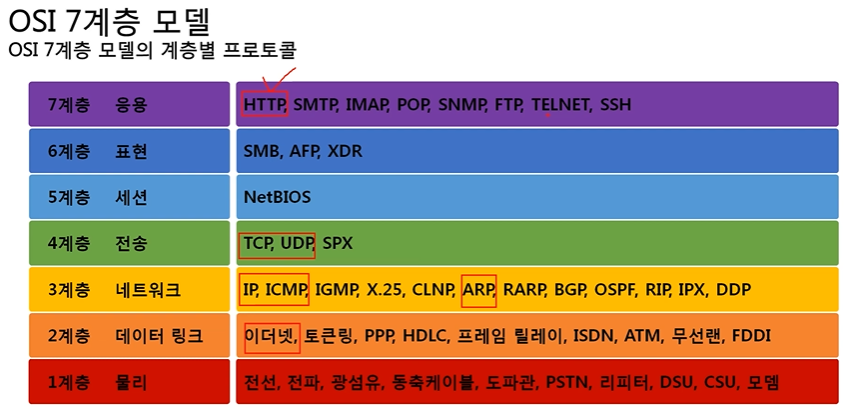
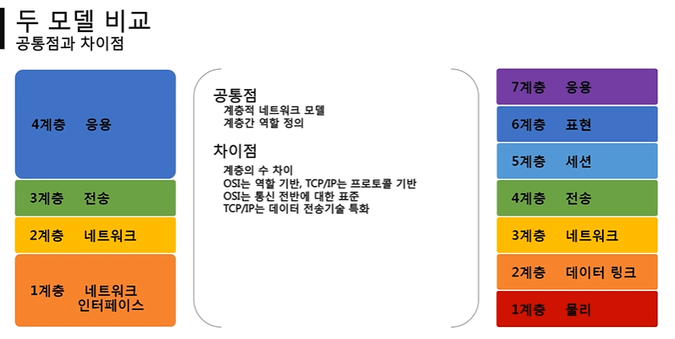

전체영상: [네트워크 기초(개정판)](https://www.youtube.com/playlist?list=PL0d8NnikouEWcF1jJueLdjRIC4HsUlULi)

### [네트워크란?](https://youtu.be/Av9UFzl_wis?list=PL0d8NnikouEWcF1jJueLdjRIC4HsUlULi)

- ### [실습1 (tracert)](https://youtu.be/paJf7JbBWqY?list=PL0d8NnikouEWcF1jJueLdjRIC4HsUlULi)

- 

### [실습2 (Wireshark)](https://youtu.be/vBrQ3yzerMg?list=PL0d8NnikouEWcF1jJueLdjRIC4HsUlULi)

- ### [네트워크 모델](https://youtu.be/y9nlT52SAcg?list=PL0d8NnikouEWcF1jJueLdjRIC4HsUlULi)

-

# 01. 네트워크란 무엇인가?

- 네트워크란?
  
  - 노드들이 데이터를 공유할 수 있게 하는 디지털 전기통신망의 하나.
  
  - 즉, 분산된 컴퓨터를 통신망으로 연결한 것을 말한다.
  
  - 네트워크에서 여러 장치들은 노드 간 연결을 사용하여 서로에게 데이터를 교환한다.

- 인터넷이란?
  
  - 문서, 그림, 영상과 같은 여러가지 데이터를 공유하도록 구성된 세상에서 가장 큰 전세계를 연결하는 네트워크.
  
  - www를 인터넷으로 착각하는 경우가 많은데, www는 인터넷을 통해 웹과 관련된 데이터를 공유하는 것.

## 네트워크의 분류

- 크기에 따른 분류
  
  - **LAN** - Local Area Network
    
    - 가까운 지역을 하나로 묶은 네트워크.
  
  - **WAN** - Wide Area Network
    
    - 멀리 있는 지역을 한데 묶은 네트워크, 가까운 지역끼리 묶인 LAN과 LAN을 다시 하나로 묶은 것.
  
  - MAN - Metropolitan Area Network
  
  - VLAN, CAN, PAN 등...

- 연결 형태에 따른 분류
  
  - **Star 형** - 중앙 장비에 모든 노드가 연결된
  
  - **Mesh 형** - 여러 노드들이 서로 그물처럼 연결된
  
  - Tree 형 - 마치 나무의 가지처럼 계층 구조로 연결된
  
  - 링형, 버스형, 혼합형 등... 
    
    - 실제로는 혼합형이다.

## 네트워크의 통신방식

- 네트워크에서 데이터는 어떻게 주고 받는가?
  
  - 유니 캐스트 - 특정 대상이랑만 1:1로 통신하는
  
  - 멀티 캐스트 - 특정 다수와 1:N으로 통신하는
  
  - 브로드 캐스트 - 네트워크에 있는 모든 대상과 통신하는

- 프로토콜이란?
  
  - 프로토콜은 일종의 약속, 양식
  
  - 네트워크에서 노드와 노드가 통신할 때 **어떤 노드**가 **어느 노드**에게 **어떤 데이터**를 **어떻게** 보내는지 작성하기 위한 양식
  
  - 택배는 택배만의, 편지는 편지만의, 전화는 전화만의 양식

- 여러가지 프로토콜
  
  - Ethernet 프로토콜 (MAC 주소) - 가까운 곳과 연락할 때
  
  - ICMP, IPv4, ARP (IP 주소) - 멀리 있는 곳과 연락할 때
  
  - TCP, UDP (포트 번호) - 여러가지 프로그램으로 연락할 때
  
  - 여러 프로토콜들로 캡슐화된 패킷

## 실습 1

- cmd 창에 `tracert 8.8.8.8` 입력...

```powershell
최대 30홉 이상의
dns.google [8.8.8.8](으)로 가는 경로 추적:

  1    <1 ms    <1 ms    <1 ms  192.168.0.1
  2     1 ms     1 ms     1 ms  192.168.10.1
  3     *        *        *     요청 시간이 만료되었습니다.
  4     3 ms     1 ms     2 ms  10.21.138.97
  5     1 ms     1 ms     1 ms  1.208.140.25
  6     2 ms     1 ms     1 ms  1.208.140.25
  7     2 ms     1 ms     2 ms  1.213.141.49
  8     2 ms     2 ms     2 ms  1.213.107.85
  9     *        *        *     요청 시간이 만료되었습니다.
 10     2 ms     2 ms     2 ms  1.213.148.37
 11    38 ms    37 ms    49 ms  203.233.96.222
 12    37 ms    37 ms    37 ms  1.208.179.94
 13    37 ms    37 ms    37 ms  142.250.168.244
 14    37 ms    37 ms    37 ms  72.14.233.125
 15    37 ms    37 ms    37 ms  108.170.225.13
 16    38 ms    38 ms    37 ms  dns.google [8.8.8.8]

추적을 완료했습니다.
```

내 컴퓨터가 미국에 있는 google dns 서버와 통신하려고 한다.

거기까지 가기 위해 거쳐간 네트워크 랜 대역들이다.

(요청 시간 만료는 비공개)

## 실습 2

- wireshark 실습
  
  - wireshark: 네트워크 패킷을 캡처하고 분석하는 오픈소스 도구.

# 02. 네트워크의 기준! 네트워크 모델

## 네트워크 계층 모델

- TCP/IP 모델
  
  - 1980년대 초 프로토콜 모델로 공개
  
  - 현재 인터넷에서 컴퓨터들이 서로 정보를 주고받는데 쓰이는 통신 규약의 모음이다.

- OSI 7계층
  
  - 1984년 ISO에서 표준으로 지정한 모델
  
  - 데이터를 주고받을 때 데이터 자체의 흐름을 각 구간별로 나눠 놓은 것





(OSI 7 Layer는 논리적으로 통신 전반에 걸쳐 역할을 나눈 것,

TCP/IP는 네트워크를 통해 데이터를 전달할 때 기술 자체를 분류한 느낌.)

(다시 말해 OSI 7 계층은 논리적인 것이고, TCP/IP는 조금 더 실무적인 것. 면접이나 시험에서는 OSI 7 계층을 더 많이 물어보는 편.)


## 네트워크를 통해 전달되는 데이터, 패킷

- 패킷이란?
  
  - 네트워크 상에서 전달되는 데이터를 통칭하는 말. (데이터의 형식화된 블럭)
  
  - 패킷은 제어 정보와 사용자 데이터로 이루어지며, 사용자 데이터는 페이로드라고도 한다.
  
  - 헤더 / 페이로드 / (풋터)
    
    - Ethernet / IPv4 / TCP / HTTP 이런 형식의 패킷이 있다면,
      
      - HTTP 프로토콜을 페이로드로 해서 TCP라는 헤더를 붙이고, 이 패킷을 페이로드로 해서 IPv4라는 헤더를 붙이고, 또 이 패킷을 페이로드로 해서 Ethernet이라는 헤더를 붙여서 생긴 패킷.

- 캡슐화(encapsulation) - 여러 프로토콜을 이용해서 최종적으로 보낼 때 패킷을 만드는 과정

- 디캡슐화(decapsulation) - 패킷을 받았을 때 프로토콜들을 하나씩 확인하면서 데이터를 확인하는 과정

- 계층별 패킷의 이름 PDU (Protocol Data Unit)
  
  - 4계층의 PDU (TCP / 데이터) : 세그먼트
  
  - 3계층의 PDU (IPv4 / (세그먼트)) : 패킷
  
  - 2계층의 PDU (Ethernet / (패킷)) : 프레임