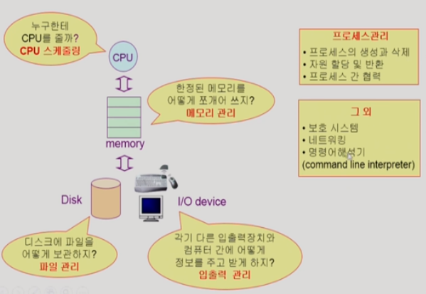

# 운영체제 개요

## 운영체제(Operating System)란?

- 컴퓨터 하드웨어 바로 위에 설치되어,사용자 및 다른 모든 소프트웨어와 하드웨어를 연결하는 소프트웨어 계층

- 좁은 의미의 운영체제(커널)
  
  - 운영체제의 핵심 부분으로, 메모리에 상주하는 부분

- 넓은 의미의 운영체제
  
  - 커널 뿐 아니라 각종 주변 시스템 유틸리티를 포함한 개념

## 운영체제의 목표

- 컴퓨터 시스템의 **자원을 효율적으로 관리**
  
  - 프로세서(CPU), 기억장치(메모리), 입출력 장치 등의 효율적 관리
    
    - 주어진 자원에서 최대한의 성능
    
    - 사용자간 형평성 있는 자원 분배

## 운영체제의 분류

- 동시 작업 가능 여부
  
  - 단일 작업(single tasking)
    
    - MS-DOS 프롬프트 상에서는 한 명령 수행 완료 전에는 다른 명령 수행이 불가능
  
  - 다중 작업(multi tasking)
    
    - UNIX, MS Windows 등에서는 다중 작업 가능

- 사용자 수
  
  - 단일 사용자(single user)
    
    - MS-DOS, MS Windows
  
  - 다중 사용자(multi user)
    
    - UNIX, NT server

- 처리 방식
  
  - 일괄 처리(batch processing)
    
    - 작업 요청 일정량 모아서 한 번에 처리
    
    - 작업 완전 종료까지 기다려야 함
  
  - 시분할(time sharing)
    
    - 우리가 쓰는 컴퓨터
    
    - 여러 작업 수행 시 컴퓨터 처리 능력을 일정 시간단위로 분할하여 사용
    
    - 일괄 처리 시스템에 비해 짧은 응답 시간을 가짐
      
      - ex) UNIX
    
    - interative한 방식
  
  - 실시간(Realtime OS)
    
    - 특수한 목적을 가진 시스템에 사용
    
    - 정해진 시간 안에 어떠한 일이 반드시 종료됨이 보장되어야 하는 실시간 시스템을 위한 OS
      
      - ex) 원자로/공장 제어, 미사일 제어 등 정교한...
    
    - 실시간 시스템의 개념 확장
      
      - Hard realtime system(경성 실시간 시스템)
        
        - 중간 종료되면 치명적인...
      
      - Soft realtime system(연성 실시간 시스템)
        
        - 치명적이진 않은... 하지만 deadline이 존재하긴 하는...

## 용어

- Multitasking

- Multiprogramming (메모리를 강조)

- Time sharing (시분할. CPU를 강조)

- Multiprocess (비슷하다)

- 구분: 모두 컴퓨터에서 여러 작업을 동시에 수행함을 의미함. 하지만 Multiprogramming은 **메모리**에 여러 프로그램이 동시에 올라가는 걸 강조하고, Time sharing은 **CPU**의 시간을 분할하여 나누어 쓰는 것을 강조한다.

- Multiprocessor \*
  
  - 하나의 컴퓨터에 CPU(processor)가 여러 개 붙어 있음을 의미한다!

## 운영체제의 예

- UNIX
  
  - 대부분 코드를 C언어로 작성
  
  - 높은 이식성
  
  - 최소한의 커널 구조
  
  - 복잡한 시스템에 맞게 확장 용이
  
  - 소스 코드 공개
  
  - 프로그램 개발 용이
  
  - 다양한 버전
    
    - System V, FreeBSD, SunOS, Solaris
    
    - Linux (Open Source!) (안드로이드도 리눅스 커널을 사용함)

- DOS(Disk Operating System)
  
  - MS사에서 1981년 IBM-PC를 위해 개발
  - 단일 사용자용 OS, 메모리 관리 능력의 한계(주 기억장치: 640kb)

- MS Windows
  
  - MS사의 다중 작업용 GUI 기반 운영체제
  - Plug and Play, 네트워크 환경 강화
  - DOS용 응용 프로그램과 호환성 제공
  - 불안정성 (초기보다 나아짐)
  - 풍부한 지원 소프트웨어

- Handheld device를 위한 OS
  
  - PalmOS, Pocket PC (WinCE), Tiny OS

## 운영체제의 구조

- CPU 스케줄링

- 메모리 관리

- 파일 관리

- 입출력 관리

- 프로세스 관리

- 그 외 (보호 시스템, 네트워킹, 명령어 해석기)

