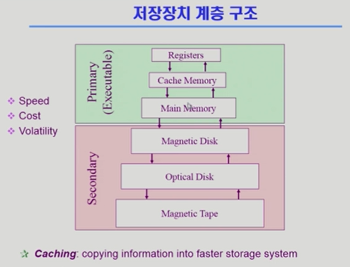
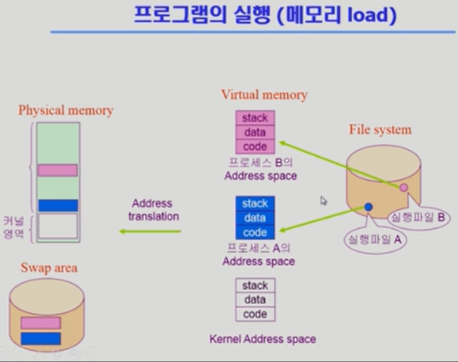
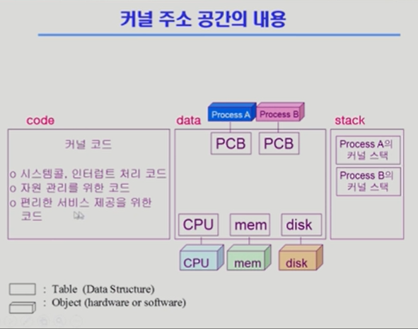
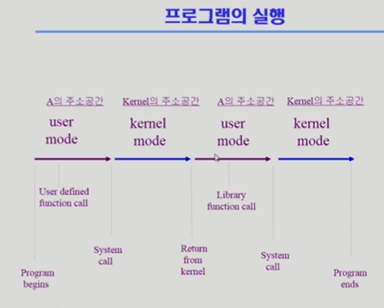

# 2. 컴퓨터 시스템의 구조

CPU:

- CPU에 비해 Disk는 백만배정도 느리다.

- CPU는 메모리의 instruction을 실행하기만 한다. (다음 instruction의 주소가 계속 증가하면서 다음 instruction을 계속해서 실행함.)

register:

- CPU안에는 메모리보다 더 빠르면서 정보를 저장할 수 있는 작은 공간 register가 있다.

mode bit:

- 운영체제인지 사용자프로그램인지 구분해준다.
  
  - 1: 사용자 모드: 사용자 프로그램 수행
  
  - 0: 모니터 모드(=커널 모드): OS 코드 수행

interrupt line:

- CPU는 메모리에 있는 instruction을 실행하기만 하는데, scanf와 같이 프로그램 실행 중 IO디바이스와 상호작용이 필요할 땐 어떻게 하냐? 그걸 전달하기 위해 interrupt line이 필요하다.
  
  - interrupt(넓은 의미)
    
    - interrupt(하드웨어 인터럽트): 하드웨어가 발생시킨 인터럽트
    
    - trap(소프트웨어 인터럽트):
      
      - Exception: 프로그램이 오류를 범한 경우
      
      - System call: 프로그램이 커널 함수를 호출하는 경우
  
  - 용어
    
    - 인터럽트 벡터
      
      - 해당 인터럽트 처리 루틴 주소를 가지고 있음
    
    - 인터럽트 처리 루틴 (=인터럽트 핸들러)
      
      - 해당 인터럽트를 처리하는 커널 함수

timer:

- 특정 프로그램이 CPU를 독점하는 현상을 방지하기 위해 존재. 여러 프로그램이 실행되면 프로그램한테 CPU를 넘겨준다. 이 때 timer에 값을 세팅한 다음에 넘겨준다. 할당된 시간(수십 ms)이 지나면 interrupt line이 CPU에게 알려준다.

DMA controller:

- direct memery access. 그래서 메모리는 CPU와 DMA 둘 다 접근하는데, 동시 접근하면 안되기 때문에 memory controller가 중재를 해준다.

- IO장치가 너무 interrupt를 많이 거니까, 중간중간 IO장치에 들어오는 내용을 다 정리해서 메모리에 copy까지 한 다음에, CPU에게 interrupt를 한 번에 걸어줌.

IO장치:

- Disk는 보조기억장치이기도 하지만, Disk의 내용을 메모리로 읽어들이기도 하고, 처리 결과를 Disk의 파일시스템에 저장하기도 하는 I/O 기기이다.

- device controller
  
  - 각 IO device는 전담 CPU인 device controller가 있다. 내부 통제는 CPU가 아닌 device controller가 맡는다. (각 작업 공간, memory같은게 필요한데, 그걸 local buffer라고 부른다.) -> hardware

- device driver:
  
  - OS 코드 중 각 장치별 처리 루틴 -> software

## 정리

- 위 그림과 같이 최 하단의 OS에게 CPU가 있을 때, A가 실행되려면 OS가 timer에 시간을 세팅하면서 OS가 가지고 있던 CPU를 A에게 넘겨줘야 한다. 그리고 만약 timer 설정 값을 초과하면 interrupt line을 통해 CPU는 자동으로 OS로 돌아오고, OS는 다시 다음 프로그램인 B에게 timer 세팅과 함께 CPU를 넘겨준다. 이 작업이 반복된다.

- A가 IO장치 접근이 필요한 상황이다. IO장치 접근은 OS만 할 수 있기 때문에(보안상의 이유로), A는 CPU를 OS에게 넘겨줘야 한다. OS는 IO controller에게 해당 작업을 시키고, OS는 노는 CPU를 다음 프로그램인 B에게 넘겨준다. B가 실행되는 중에 IO장치가 값을 주면, interrupt line을 통해 알려주고, 그럼 CPU는 다시 OS에게 돌아오게 되고, 입력을 A의 필요한 메모리 공간에 copy해 준 다음, B에게 다시 CPU를 주고 남은 시간 동안 CPU를 쓰게 한 다음, 계속해서 메모리 상의 프로그램들을 순차적으로 실행한다. (A의 순서가 될 때에야 입력을 처리할 수 있게 된다.)

- IO를 위해 어떤 interrupt가 필요한가?
  
  - 사용자 프로그램이 IO 장치의 입력을 요청할 때는 Software interrupt(trap)를 통해 요청하고, IO가 끝났으면 hardware interrupt를 통해 끝났다는 것을 알려준다. 즉, 둘 다 필요하다.

---

## 동기식 입출력과 비동기식 입출력

- 동기식 입출력 (synchronous I/O)
  
  - I/O 요청 후 입출력 작업이 완료된 후에야 제어가 사용자 프로그램에 넘어감
  
  - 구현 방법 1
    
    - I/O 끝날 때까지 CPU를 낭비시킴
    
    - 매시점 하나의 I/O만 일어날 수 있음
  
  - 구현 방법 2
    
    - I/O가 완료될 때까지 해당 프로그램에게서 CPU를 빼앗음
    
    - I/O처리를 기다리는 줄에 그 프로그램을 줄 세움
    
    - 다른 프로그램에 CPU를 줌

- 비동기식 입출력 (asynchronous I/O)
  
  - I/O가 시작된 후 입출력 작업이 끝나기를 기다리지 않고 제어가 사용자 프로그램에 즉시 넘어감

## DMA (Direct Memory Access)

- 빠른 입출력 장치를 메모리에 가까운 속도로 처리하기 위해 사용

- CPU의 중재 없이 device controller가 device의 buffer storage의 내용을 메모리에 block 단위로 직접 전송

- 바이트 단위가 아니라 block 단위로 인터럽트를 발생시킴

## 서로 다른 입출력 명령어

- I/O를 수행하는 special instruction에 의해

- Memory Mapped I/O에 의해

## 저장장치 계층 구조

연두: 휘발성

빨강: 비휘발성 (대체로)

## 프로그램 실행 (메모리 load)

file system의 실행파일 A를 실행시키면, 그의 Address space가 생긴다. (Virtual memory) code, data, stack으로 이루어진다.

프로그램마다 독자적 주소공간을 갖고있는데, 이걸 물리적 메모리 공간에 올려야 된다. 모두 올리는 건 아니고, 당장 필요한 부분만 올린다.

### 커널 주소 공간의 내용

### 사용자 프로그램이 사용하는 함수

- 함수
  
  - 사용자 정의 함수
    
    - 자신의 프로그램에서 정의한 함수
  
  - 라이브러리 함수
    
    - 자신의 프로그램에서 정의하지 않고 갖다 쓴 함수
    
    - 자신의 프로그램의 실행 파일에 포함되어 있다
  
  - 커널 함수
    
    - 운영체제 프고그램의 함수
    
    - 커널 함수의 호출 = 시스템 콜

## 프로그램의 실행

