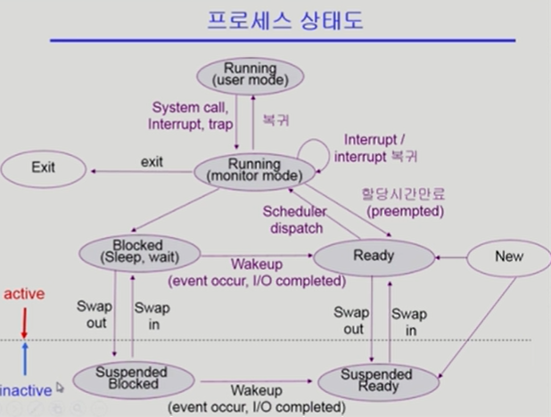
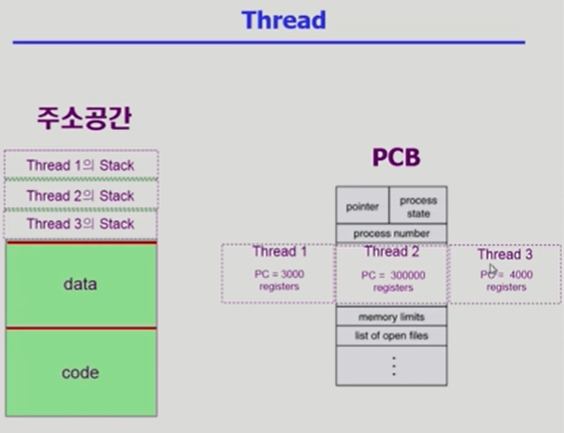
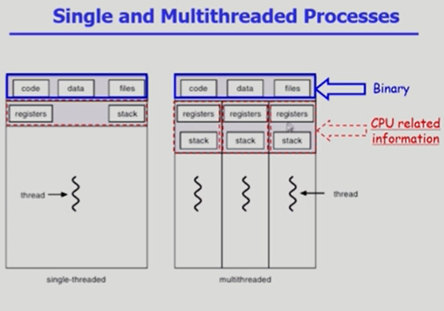

# 3. 프로세스

## 프로세스의 개념

- Process is a **progame in execution**

- 프로세스의 문맥(context)
  
  - CPU 수행 상태를 나타내는 하드웨어 문맥
    
    - Program Counter
    
    - 각종 register
  
  - 프로세스의 주소 공간
    
    - code, data, stack
  
  - 프로세스 관련 커널 자료 구조
    
    - PCB (Process Control Block)
    
    - Kernel stack

## 프로세스의 상태 (Process State)

- 프로세스는 상태(state)가 변경되며 수행된다
  
  - **Running**
    
    - CPU를 잡고 instruction을 수행 중인 상태
  
  - **Ready**
    
    - CPU를 기다리는 상태(메모리 등 다른 조건을 모두 만족하고)
  
  - **Blocked** (wait, sleep)
    
    - CPU를 주어도 당장 instrucrtion을 수행할 수 없는 상태 (자진해서 Blocked)
    
    - Process 자신이 요청한 event(예: I/O)가 즉시 만족되지 않아 이를 기다리는 상태
    
    - (예) 디스크에서 file을 읽어와야 하는 경우
  
  - **Suspended** (stopped)
    
    - 외부적인 이유로 프로세스 수행이 정지된 상태
    
    - 프로세스는 통째로 디스크에 swap out된다
    
    - (예) 사용자가 프로그램을 일시 정지시킨 경우 (break key)
      시스템이 여러 이유로 프로세스를 잠시 중단시킴 (메모리에 너무 많은 프로세스가 올라와 있을 때)
  
  - New: 프로세스가 생성 중인 상태
  
  - Terminated: 수행(execution)이 끝난 상태

- Blocked: 자신이 요청한 event가 만족되면 Ready

- Suspended: 외부에서 resume해줘야 Active

## PCB (Process Control Block)

- 운영체제가 각 프로세스를 관리하기 위해 프로세스당 유지하는 정보

- 다음의 구성 요소를 가진다. (구조체로 유지)
  
  - (1) OS가 관리상 사용하는 정보
    
    - Process state, Process ID
    
    - scheduling information, priority
  
  - (2) CPU 수행 관련 하드웨어 값
    
    - Program counter, registers
  
  - (3) 메모리 관련
    
    - Code, data, stack의 위치 정보
  
  - (4) 파일 관련
    
    - Open file descriptors ...

## 문맥 교환 (Context Switch)

- CPU를 한 프로세스에서 다른 프로세스로 넘겨주는 과정

- CPU가 다른 프로세스에게 넘어갈 때 운영체제는 다음을 수행
  
  - CPU를 내어주는 프로세스의 상태를 그 프로세스의 PCB에 저장
  
  - CPU를 새롭게 얻는 프로세스의 상태를 PCB에서 읽어옴

- System call이나 Interrupt 발생시 반드시 context switch가 일어나는 것은 아님
  
  - 사용자 프로세스 -> OS -> 같은 사용자 프로세스 (context switch 안 일어남!)
  
  - 사용자 프로세스 -> OS -> **다른** 사용자 프로세스 (**context switch!**)

- 사실 위 경우에도 CPU 수행 정보 등 context 일부를 PCB에 save해야 함. 아래 경우는 그 부담이 훨씬 큼. (eg. cache memory flush)

## 프로세스를 스케줄링하기 위한 큐

- Job queue
  
  - 현재 시스템 내에 있는 모든 프로세스의 집합

- Ready queue
  
  - 현재 메모리 내에 있으면서 CPU를 잡아서 실행되기를 기다리는 프로세스의 집합

- Device queues
  
  - I/O device의 처리를 기다리는 프로세스의 집합

- 프로세스들은 각 큐들을 오가며 수행된다

## 스케줄러

- Short-term scheduler (단기 스케줄러 or CPU scheduler)
  
  - 어떤 프로세스를 다음번에 running 시킬지 결정
  
  - 프로세스에 CPU를 주는 문제
  
  - 충분히 빨라야 한 (millisecond 단위)

- Long-term scheduler (장기 스케줄러 or Job scheduler)
  
  - 시작 프로세스 중 어떤 것들을 ready queue로 보낼지 결정
  
  - 프로세스에 memory(및 각종 자원)을 주는 문제
  
  - **degree of Multiprogramming**을 제어
  
  - time sharing system에는 <u>보통 장기 스케줄러가 없음</u> (무조건 ready)

- Medium-Term Scheduler (중기 스케줄러 or Swapper)
  
  - 여유 공간 마련을 위해 프로세스를 통째로 메모리에서 디스크로 쫓아냄
  
  - 프로세스에게서 memory를 뺏는 문제
  
  - **degree of Multiprogramming**을 제어
    
    - (보통 장기 스케줄러가 없고, 대신 중기 스케줄러가 여유공간을 만들어주는 역할)

suspend는 memory를 잃어버린(swap out된) 상태

CPU관점에선 아무 일을 할 수 없지만 I/O같은 일이 진행중이었다면 Suspended Blocked에서 Suspended Ready로 넘어갈 수는 있다.

---

## Thread

- CPU를 수행하는 단위!
  
  - 프로세스 내부에 쓰레드가 여러개 있을 수 있다.

- "A thread (or lightweight process) is a basic unit of CPU utilization"

- Thread의 구성
  
  - program counter
  
  - register set
  
  - stack space

- Thread가 동료 thread와 공유하는 부분(=task)
  
  - code section
  
  - data section
  
  - OS resources

- 전통적인 개념의 heavyweight process는 하나의 thread를 가지고 있는 task로 볼 수 있다.

프로세스는 하나만 띄우고, CPU가 현재 코드의 어느 부분을 실행하고 있는지 = program counter, register에 어떤 값을 넣는지만 여러개를 둔다.

- 다중 스레드로 구성된 태스크 구조에서는 하나의 서버 스레드가 blocked(waiting) 상태인 동안에도 동일한 태스크 내의 다른 스레드가 실행(running)되어 빠른 처리를 할 수 있다.

- 동일한 일을 수행하는 다중 스레드가 협력하여 높은 처리율(throughput)과 성능 향상을 얻을 수 있다.

- 스레드를 사용하면 병렬성을 높일 수 있다.

- Process 하나당 PCB는 하나. Thread가 여러개라면 CPU 수행 관련 정보만 각각 별도의 카피를 갖게 됨. (program counter, register정보)

## Thread의 장점

- Responsiveness (응답성) (사용자 입장에서 빠름)
  
  - eg) multi-threaded Web - if one thread is blocked(eg network) another one continues (eg display)

- Resource Sharing (자원의 공유)
  
  - n threads can share binary code, data, resource of the process

- Economy (경제성)
  
  - creating & CPU switching thread (rather than a process)
  
  - Solaris의 경우 위 두 가지 overhead가 각각 30배, 5배

- ~~(CPU가 여러개 있을 때...)~~ Utilization of MP Architectures (Multi-Processor)
  
  - each thread may be running in parallel on a different processor

## Thread 구현 방법

- Some are supported by **kernel** 
  
  - **Kernel Threads** - thread가 여러개 있다는 사실을 커널이 알고 있다. 하나의 스레드에서 다른 스레드로 CPU가 넘어가는 것도 커널이 CPU 스케줄링 하듯이 넘겨준다.
  
  - Windows 95/98/NT
  
  - Solaris
  
  - Digital UNIX, Mach

- Others are supported by **library**
  
  - **User Threads** - thread가 여러개 있다는 사실을 운영체제는 모른다. 유저 프로그램이 스스로 관리한다. 때문에 유저 스레드는 구현상 약간의 제약점이 있다 정도.
  
  - POSIX Pthreads
  
  - Mach C-threads
  
  - Solaris threads

- Some are real-time threads
