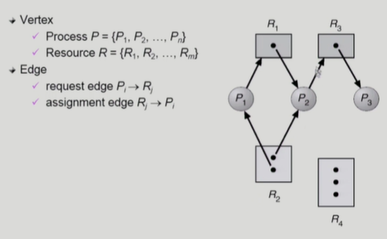
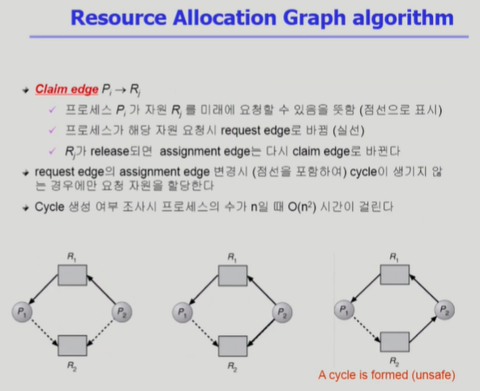
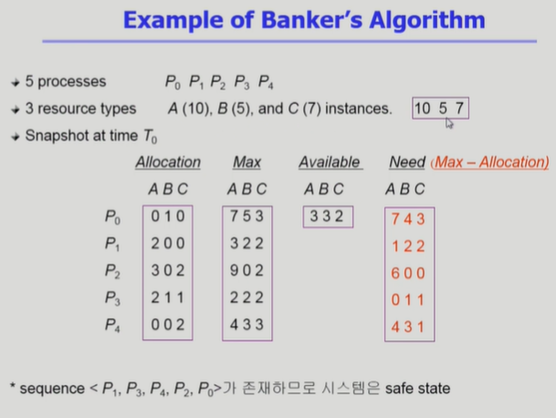
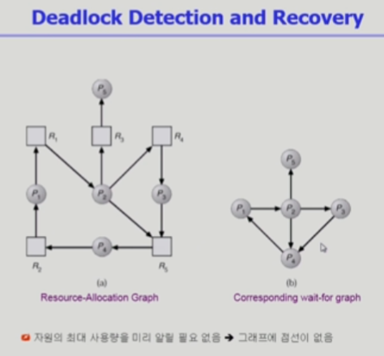
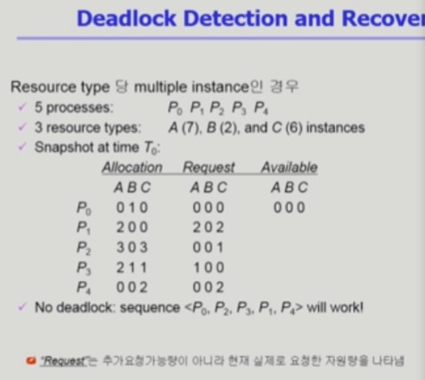

# 7. 교착상태

## The Deadlock Problem

- Deadlock
  
  - 일련의 프로세스들이 서로가 가진 자원을 기다리며 block된 상태

- Resource (자원)
  
  - 하드웨어, 소프트웨어 등을 포함하는 개념
  
  - (예) I/O device, CPU cycle, memory space, semaphore 등
  
  - 프로세스가 자원을 사용하는 절차
    
    - Request, Allocate, Use, Release

- Deadlock Example 1
  
  - 시스템에 2개의 tape drive가 있다
  
  - 프로세스 P1과 P2 각각이 하나의 tape drive를 보유한 채 다른 하나를 기다리고 있다

## Deadlock 발생의 4가지 조건

- Mutual exclusion (상호 배제)
  
  - 매 순간 하나의 프로세스만이 자원을 사용할 수 있음

- No preemption (비선점)
  
  - 프로세스는 자원을 스스로 내어놓을 뿐 강제로 빼앗기지 않음

- Hold and wait (보유대기)
  
  - 자원을 가진 프로세스가 다른 자원을 기다릴 때 보유 자원을 놓지 않고 계속 가지고 있음

- Circular wait (순환대기)
  
  - 자원을 기다리는 프로세스간에 사이클이 형성되어야 함
  
  - 프로세스 P0, P1, ... Pn이 있을 때
    
    - P0은 P1이 가진 자원을 기다리고
    
    - P1은 P2가 가진 자원을 기다리고
    
    - ...
    
    - Pn은 P0이 가진 자원을 기다리는 상황

## Resource-Allocation Graph (자원할당 그래프)

## Deadlock의 처리 방법

- Deadlock Prevention
  
  - 자원 할당 시 Deadlock의 4가지 필요 조건 중 어느 하나가 만족되지 않도록 하는 것

- Deadlock Avoidance
  
  - 자원 요청에 대한 부가적인 정보를 이용해서 deadlock의 가능성이 없는 경우에만 자원을 할당
  
  - 시스템 state가 원래 state로 돌아올 수 있는 경우에만 자원 할당

- Deadlock Detection and recovery
  
  - Deadlock 발생은 허용하되 그에 대한 detectino 루틴을 두어 deadlock 발견시 recover

- Deadlock Ignorance
  
  - Deadlock을 시스템이 책임지지 않음
  
  - UNIX를 포함 대부분의 OS가 채택

## Deadlock Prevention

- Mutual Exclusion
  
  - 공유해서는 안되는 자원의 경우 반드시 성립해야 함

- Hold and Wait
  
  - 프로세스가 자원을 요청할 때 다른 어떤 자원도 가지고 있지 않아야 한다
  
  - 방법 1. 프로세스 시작 시 모든 필요한 자원을 할당받게 하는 방법
  
  - 방법 2. 자원이 필요할 경우 보유 자원을 모두 놓고 다시 요청

- No Preemption
  
  - process가 어떤 자원을 기다려야 하는 경우 이미 보유한 자원이 선점됨
  
  - 모든 필요한 자원을 얻을 수 있을 때 그 프로세스는 다시 시작된다
  
  - State를 쉽게 save하고 restore할 수 있는 자원에서 주로 사용 (CPU, memory)

- Circular Wait
  
  - 모든 자원 유형에 할당 순서를 정하여 정해진 순서대로만 자원 할당
  
  - 예를 들어 순서가 3인 자원 Ri를 보유 중인 프로세스가 순서가 1인 자원 Rj을 할당받기 위해서는 우선 Ri를 release해야 한다

-> Utilization 저하, throughput 감소, starvation 문제

## Deadlock Avoidance

- Deadlock avoidance
  
  - 자원 요청에 대한 부가정보를 이용해서 자원 할당이 deadlock으로부터 안전한지를 동적으로 조사해서 안전한 경우에만 할당
  
  - 가장 단순하고 일반적인 모델은 프로세스들이 필요로 하는 각 자원별 최대 사용량을 미리 선언하도록 하는 방법임

- safe state
  
  - 시스템 내의 프로세스들에 대한 safe sequence가 존재하는 상태

- safe sequence
  
  - 프로세스의 sequence \<P1, P2, ... , Pn>이 safe하려면 Pi (1<=i<=n) 의 자원 요청이 "가용 자원 + 모든 Pj (j<i)의 보유 자원"에 의해 충족되어야 함
  
  - 조건을 만족하면 다음 방법으로 모든 프로세스의 수행을 보장
    
    - Pi의 자원 요청이 즉시 충족될 수 없으면 모든 Pj(j<i)가 종료될 때까지 기다린다
    
    - Pi-1이 종료되면 Pi의 자원 요청을 만족시켜 수행한다

위는 자원당 인스턴스가 하나 밖에 없는 경우라 그래프로 보기 쉽고, 인스턴스가 여러개인 경우면 아래와 같이...

## Banker's Algorithm

- P0와 같은 경우... Need(Max-Allocation)을 보면, 가용자원을 A 7개까지 요청할 잠재적 가능성이 있음. 때문에, 보수적인 Banker's Algorithm은 A를 하나도 주지 않음.

- 반면에, P1과 같은 경우, Available한 자원보다 Need의 자원이 작기 때문에, 얼마든지 자원을 줄 수 있음.

- 즉, 가용자원이 최대 요청 자원보다 크면, 얼마든지 준다는 게 Banker's Algorithm이다.

## Deadlock Detection and Recovery

- Deadlock Detection

  - Resource type 당 single instance인 경우
  
    - 자원할당 그래프에서의 cycle이 곧 deadlock을 의미
    
  - Resource type 당 multiple instance인 경우
 
    - Banker's algorithm과 유사한 방법 활용
    
  - Wait-for graph 알고리즘
  
    - Resource type 당 single instance인 경우
    
    - Wait-for graph
    
      - 자원할당 그래프의 변형
      
      - 프로세스만으로 node 구성
      
      - Pi가 가지고 있는 자원을 Pk가 기다리는 경우 Pk->pi
      
    - Algorithm
    
      - Wait-for graph에 사이클이 존재하는지를 주기적으로 조사
      
      - O(n^2)

- Deadlock Detection and Recovery에서 Deadlock이 있는지 확인하기 위해서는, 보수적이 아니라 낙관적으로 봐야 함.

  - 요청하고있는 자원이 있는 경우 자기가 가진 자원을 내놓지 않음 (당연한 기본 전제)
  
  - 요청하고 있는 자원이 없는 경우 '낙관적으로' 자기가 가진 자원은 모두 반납할 것이라고 봄 -> 가용 자원으로 적립
  
  - 가용 자원으로 해결 가능한 요청을 모두 처리하고, 처리된 요청과 할당 자원도 모두 가용 자원으로 적립
  
  - 불가능한 상황이 발생하지 않는다면 Deadlock 없음.

- 상황 1 : 위 그림에서 P2의 Request(요청 자원) = ' 0 0 0 ' 인 경우
  
  - P0와 P2는 가용자원이 없기 때문에 모두 반납하는 것을 상정 -> 가용 자원 = ' 3 1 3 '
  
  - P1 해결 가능하므로, 기존 가지고있던 A(2)를 가용 자원으로 분류 -> 가용 자원 = ' 5 1 3 '
  
  - 그 외 모든 프로세스도 같은 원리로 모두 가용 자원으로 적립 가능. 즉, Deadlock 없음.
  
- 상황 2 : 위 그림 그대로 ( P2가 0 0 1 )

  - P0만 0 0 0 이기 때문에, P0의 할당된 자원만 가용 자원으로 적립 -> 가용 자원 = ' 0 1 0 '
  
  - 그 외 모든 프로세스의 요청 자원 해결 불가능 -> Deadlock 있음!

- Recovery 방법:

  - Process termination
  
    - Abort all deadlocked processes
    
    - Abort one process at a time until the deadlock cycle is eliminated

  - Resouce Preemption
  
    - 비용을 최소화할 victim의 선정
    
    - safe state로 rollback하여 process를 restart
    
    - Starvation 문제
    
      - 동일한 프로세스가 계속해서 victim으로 선정되는 경우
      
      - cost factor에 rollback 횟수도 같이 고려

## Deadlock Ignorance

- Deadlock이 일어나지 않는다고 생각하고 아무 조치도 취하지 않음

  - Deadlock이 매우 드물게 발생하므로, deadlock에 대한 조치 자체가 더 큰 overhead일 수 있음.
  
  - 만약, 시스템에 deadlock이 발생한 경우 시스템이 비정상적으로 작동하는 것을 사람이 느낀 후 직접 process를 죽이는 등의 방법으로 대처
  
  - UNIX, Windows 등 대부분 범용 OS가 채택