## 11. 파일 시스템 구현

File System Implementation

## Allocation of File Data in Disk

- Contiguous Allocation

- Linked Allocation

- Indexed Allocation

## Contiguous Allocation

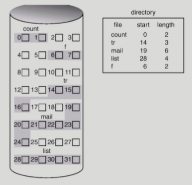

- 단점
  
  - external fragmentation
  
  - File grow가 어려움
    
    - file 생성 시 얼마나 큰 hole을 배당할 것인가?
    
    - grow 가능 vs 낭비 (internal fragmentation)

- 장점
  
  - Fast I/O
    
    - 한 번의 seek/rotation으로 많은 바이트 transfer
    
    - Realtime file 용으로, 또는 이미 run 중이던 process의 swapping 용
  
  - Direct access(=random access) 가능

## Linked Allocation

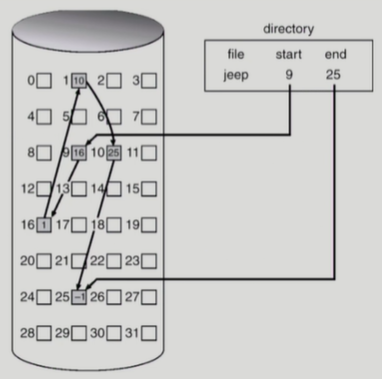

- 장점
  
  - External fragmentation 발생 안 함

- 단점
  
  - No random access
  
  - Reliability 문제
    
    - 한 sector가 고장 나 pointer가 유실되면 많은 부분을 잃음
  
  - Pointer를 위한 공간이 block의 일부가 되어 공간 효율성을 떨어뜨림
    
    - 512 bytes/sector, 4 bytes/pointer

- 변형
  
  - File-allocation table (FAT) 파일 시스템
    
    - 포인터를 별도의 위치에 보관하여 reliability와 공간 효율성 문제 해결

## Indexed Allocation

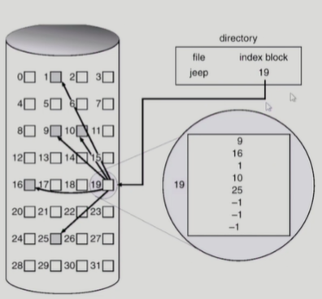

- 장점
  
  - External fragmentation이 발생하지 않음
  
  - Direct access 가능

- 단점
  
  - Small file의 경우 공간 낭비 (실제로 많은 file들이 small)
  
  - Too Large file의 경우 하나의 block으로 index를 저장하기에 부족
    
    - 해결 방안
      
      1. linked scheme
      
      2. multi-level index

(이론적으로는 그러하나, 실제로는 어떤가?)

## UNIX 파일 시스템의 구조

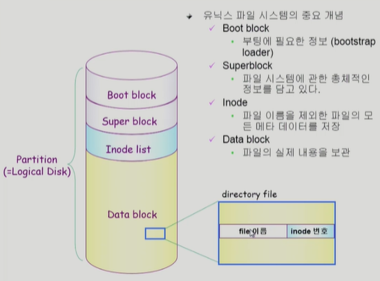

( file 하나 당 Inode 하나 씩 할당 (Index node) )

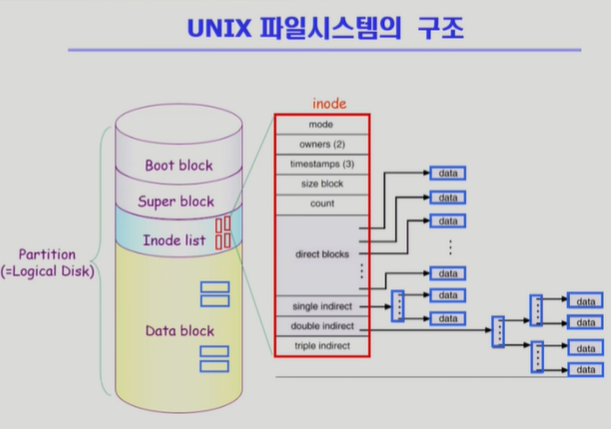

( direct blocks 는 크기가 작은 file을 위함, single, double, triple로 넘어갈 수록 크기가 큰 file을 위함)

## FAT File System

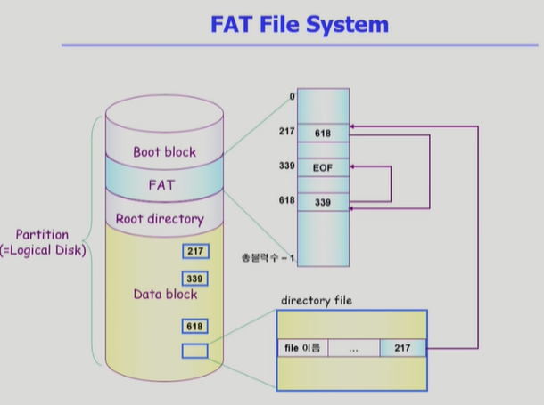

( metadata의 위치정보만 FAT이 관리. 어떤 address를 들고 FAT을 찾아가면 다음 address를 알려줌. 직접 접근이 가능해지는 장점이 있음. (Data block 경유 없이 FAT만 타고 들어가면 됨) 여러개(>=2)의 카피를 두고 있어서 reliability 높음 )

( 실제로는 UNIX와 FAT 외에도 많은 file system이 있음. )

## Free-Space Management

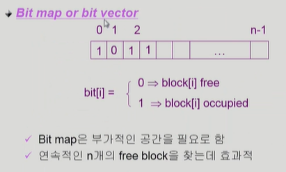

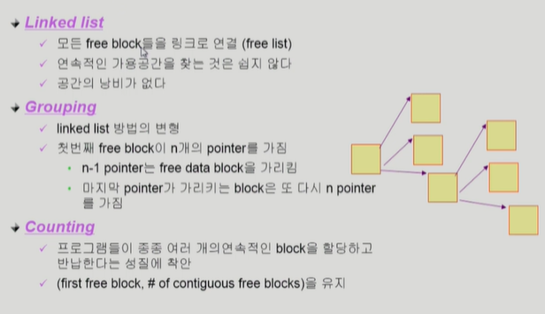

## Directory Implementation

- Linear list
  
  - \<file name, file의 metadata>의 list
  
  - 구현이 간단
  
  - 디렉토리 내에 파일이 있는지 찾기 위해서는 linear search 필요 (time-consuming)

- Hash Table
  
  - linear list + hasing
  
  - Hash table은 file name을 이 파일의 linear list의 위치로 바꾸어줌
  
  - search time을 없앰
  
  - Collision 발생 가능

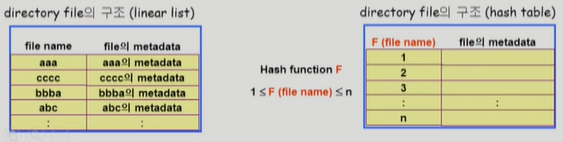

- File의 metadata의 보관 위치
  
  - 디렉토리 내 직접 보관
  
  - 디렉토리에는 포인터를 두고 다른 곳에 보관
    
    - inode, FAT 등

- Long file name의 지원
  
  - \<file name, file의 metadata>의 list에서 각 entry는 일반적으로 고정 크기
  
  - file name이 고정 크기의 entry 길이보다 길어지는 경우 entry의 마지막 부분에 이름의 뒷부분이 위치한 곳의 포인터를 두는 방법
  
  - 이름의 나머지 부분은 동일한 directory file의 일부에 존재

## VFS and NFS

- Virtual File System (VFS)
  
  - 서로 다른 다양한 file system에 대해 동일한 시스템 콜 인터페이스(API)를 통해 접근할 수 있게 해주는 OS의 layer

- Network File System (NFS)
  
  - 분산 시스템에서는 네트워크를 통해 파일이 공유될 수 있음
  
  - NFS는 분산 환경에서의 대표적인 파일 공유 방법임

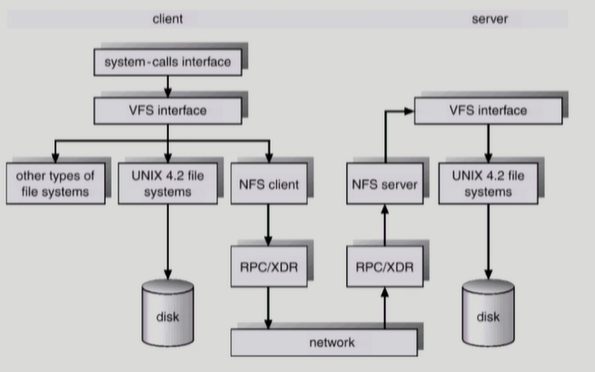

## Page Cache and Buffer Cache

- Page Cache
  
  - Virtual memory의 paging system에서 사용하는 page frame을 caching의 관점에서 설명하는 용어
  
  - Memory-Mapped I/O를 쓰는 경우 file의 I/O에서도 page cache 사용

- Memory-Mapped I/O
  
  - File의 일부를 virtual memory에 mapping시킴
  
  - 매핑시킨 영역에 대한 메모리 접근 연산은 파일의 입출력을 수행하게 함

- Buffer Cache
  
  - 파일 시스템을 통한 I/O 연산은 메모리의 특정 영역인 buffer cache 사용
  
  - File 사용의 locality 활용
    
    - 한 번 일어온 block에 대한 후속 요청 시 buffer cache에서 즉시 전달
  
  - 모든 프로세스가 공용으로 사용
  
  - Replacement algorithm 필요 (LRU, LFU 등)

- Unified Buffer Cache
  
  - 최근의 OS에서는 기존의 buffer cache가 page cache에 통합됨

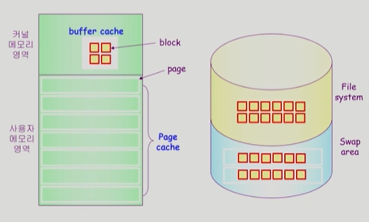

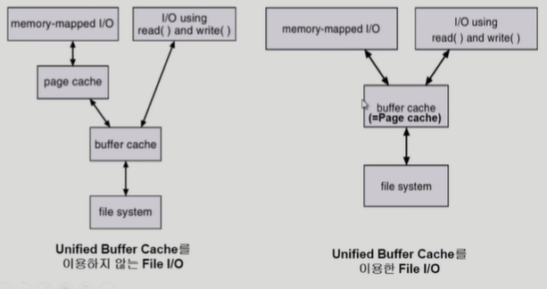

