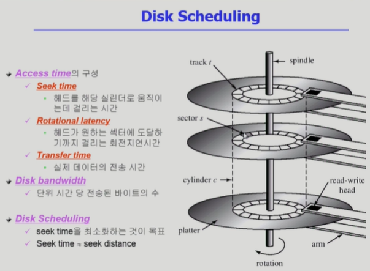

# 12. 디스크 관리 및 스케줄링

## Disk Structure

- logical block
  
  - 디스크의 외부에서 보는 디스크의 단위 정보 저장 공간들
  
  - 주소를 가진 1차원 배열처럼 취급
  
  - 정보를 전송하는 최소 단위

- Sector
  
  - Logical block이 물리적인 디스크에 매핑된 위치
  
  - Sector 0은 최외곽 실린더의 첫 트랙에 있는 첫 번째 섹터이다

