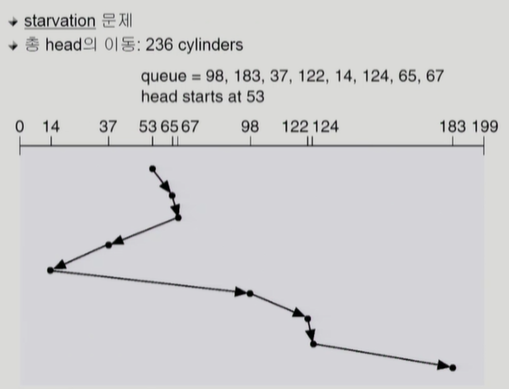

# 12. 디스크 관리 및 스케줄링

## Disk Structure

- logical block
  
  - 디스크의 외부에서 보는 디스크의 단위 정보 저장 공간들
  
  - 주소를 가진 1차원 배열처럼 취급
  
  - 정보를 전송하는 최소 단위

- Sector
  
  - Logical block이 물리적인 디스크에 매핑된 위치
  
  - Sector 0은 최외곽 실린더의 첫 트랙에 있는 첫 번째 섹터이다

( Seek time이 압도적으로 오래 걸리고, Rotational latency는 그의 10분의 1 정도, Transfer time는 굉장히 작은 시간. 대부분이 Seek time에 소요된다. )

## Disk Management

- physical formatting (Low-level formatting)
  
  - 디스크를 컨트롤러가 읽고 쓸 수 있도록 섹터들로 나누는 과정
  
  - 각 섹터는 header + 실제 data (보통 512 bytes) + trailer로 구성
  
  - header와 trailer는 sector number, ECC (Error-Correcting Code) 등의 정보가 저장되며 controller가 직접 접근 및 운영
    
    - (ECC는 해쉬값과 비슷한데, 같이 저장해두면, 꺼낼 때 대조해서 error 여부를 검사할 수 있게 된다.)

- Partitioning
  
  - 디스크를 하나 이상의 실린더 그룹으로 나누는 과정
  
  - OS는 이것을 독립적 disk로 취급 (logical disk)

- Logical formatting
  
  - 파일 시스템을 만드는 것
  
  - FAT, inode, free space 등의 구조 포함

- Booting
  
  (메모리는 비어있다. CPU는 메모리만 접근 가능하다. 메모리 영역 중 비휘발적인 ROM에 부팅을 위한 "small bootstrap loader"가 있다. 부팅을 하면 CPU 제어권이 ROM의 주소를 가리키게 된다. 따라서 부팅을 하게 되는데... 이를 순차적으로 나타내면 )
  
  - ROM에 있는 "small bootstrap loader"의 실행
  
  - sector 0 (boot block)을 load하여 실행
  
  - sector 0은 "full Bootstrap loader program"
  
  - OS를 디스크에서 load하여 실행

## Disk Scheduling Algorithm

- 큐에 다음과 같은 실린더 위치의 요청이 존재하는 경우,

- 디스크 헤드 53번에서 시작한 각 알고리즘의 수행 결과는?

98, 183, 37, 122, 14, 124, 65, 67

- FCFS

- SSTF

- SCAN

- C-SCAN

- N-SCAN

- LOOK

- C-LOOK

## FCFS(First Come First Service)

- 가장 단순하게 오는대로 처리한다

## SSTF(Shortest Seek Time First)

- Seek Time이 가장 오래 걸리는 요소이기 때문에 가까운거부터 한다

- 하지만 Starvation 문제가 발생한다

## SCAN

- 엘리베이터 스케줄링 (앞에서 뒤로 지나가면서 마주치는 요청을 처리, 왕복)

- 하지만 평균 대기시간이 다르다 (중앙에 가까울 수록 짧고, 가장자리로 갈 수록 길어진다)

## C-SCAN

- SCAN과 달리, 왕복은 하되 한 방향으로 갈 때만 요청 처리

- 평균 대기시간을 균일하게 한다

## Other Algorithms

- N-SCAN
  
  - SCAN의 변형
  
  - arm이 한 방향으로 움직이기 시작하면 그 시점 이후에 도착한 job은 되돌아올 때 service

- LOOK, C-LOOK
  
  - SCAN이나 C-SCAN은 헤드가 디스크 끝에서 끝으로 이동
  
  - LOOK과 C-LOOK은 헤드가 진행 중이다가 그 방향에 더 이상 기다리는 요청이 없으면 헤드의 이동방향을 즉시 반대로 이동

- 기본적으로 Disk scheduling algo는 **SCAN** 기반으로 한다.

## Disk-Scheduling Algorithm의 결정

- SCAN, C-SCAN 및 그 응용 알고리즘은 LOOK, C-LOOK 등이 일반적으로 디스크 입출력이 많은 시스템에서 효율적인 것으로 알려져 있음

- File의 할당 방법에 따라 디스크 요청이 영향을 받음

- 디스크 스케줄링 알고리즘은 필요할 경우 다른 알고리즘으로 쉽게 교체할 수 있도록 OS와 별도의 모듈로 작성되는 것이 바람직하다

## Swap-Space Management

- Disk를 사용하는 두 가지 이유
  
  - memory의 volatile한 특성 -> file system
  
  - 프로그램 실행을 위한 memory 공간 부족 ->swap space (swap area)

- Swap-space
  
  - Virtual memory system에서는 디스크를 memory의 연장 공간으로 사용
  
  - 파일시스템 내부에 둘 수도 있으나 별도 partition 사용이 일반적
    
    - 공간효율성보다는 속도 효율성이 우선
    
    - 일반 파일보다 훨씬 짧은 시간만 존재하고 자주 참조됨
    
    - 따라서, block의 크기 및 저장 방식이 일반 파일시스템과 다름

## RAID

- RAID (Redundant Array of Independent Disks)
  
  - 여러 개의 디스크를 묶어서 사용

- RAID의 사용 목적
  
  - 디스크 처리 속도 향상
    
    - 여러 디스크에 block의 내용을 분산 저장
    
    - 병렬적으로 읽어 옴(interleaving, striping)
  
  - 신뢰성(reliability) 향상
    
    - 동일 정보를 여러 디스크에 중복 저장
    
    - 하나의 디스크가 고장(failure)시 다른 디스크에서 읽어옴 (Mirroring, shadowing)
    
    - 단순한 중복 저장이 아니라 일부 디스크에 parity를 저장하여 공간의 효율성을 높일 수 있다
