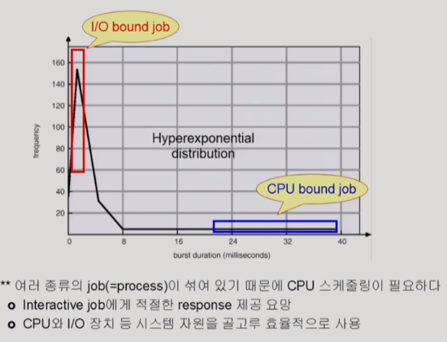

# 5. CPU 스케줄링

## CPU and I/O Bursts in Program Execution

모든 프로그램은 위와 같이, **CPU에서 instruction을 실행**하고(CPU burst), **오래 걸리는 I/O 작업을 실행**하는 것(I/O burst)을 번갈아가며 실행한다.

CPU를 누구에게 줄 것인가, 줬으면 계속 쓰게 할 것인가...?

## CPU-burst Time의 분포

## 프로세스의 특성 분류

- 프로세스는 그 특성에 따라 다음 두 가지로 나눔
  
  - I/O-bound process
    
    - CPU를 잡고 계산하는 시간보다 I/O에 많은 시간이 필요한 job
    
    - (many short CPU bursts)
  
  - CPU-bound process
    
    - 계산 위주의 job
    
    - (few very long CPU bursts)

## CPU Scheduler & Dispatcher

(둘 다 운영체제 안에 있는 코드이다...)

- CPU Scheduler
  
  - Ready 상태의 프로세스 중에서 이번에 CPU를 줄 프로세스를 고른다

- Dispatcher
  
  - CPU의 제어권을 CPU scheduler에 의해 선택된 프로세스에게 넘긴다
  
  - 이 과정을 context switch(문맥 교환)라고 한다

- CPU 스케줄링이 필요한 경우는 프로세스에게 다음과 같은 상태 변화가 있는 경우이다
  
  1. Running -> Blocked (예: I/O 요청하는 시스템 콜)
  
  2. Running -> Ready (예: 할당시간 만료로 timer interrupt)
  
  3. Blocked -> Ready (예: I/O 완료 후 인터럽트)
  
  4. Terminate

- 1, 4는 비선점형, nonpreemptive (=강제로 빼앗지 않고 자진 반납)

- 나머지는 선점형, preemptive (=강제로 빼앗음) (현대의 CPU 스케줄링은 대부분 이것)

## Scheduling Criteria

### Performance Index(=Performance Measure, 성능 척도)

#### 시스템 입장

- CPU utilization(이용료)
  
  - keep the CPU as busy as possible
  
  - 전체 시간 중 CPU가 놀지 않고 일한 비율

- Throughput(처리량)
  
  - \# of processes that complete their execution per time unit
  
  - 주어진 시간 동안 수행한 작업 개수

#### 프로세스 입장

- Turnaround time(소요 시간, 반환 시간)
  
  - amount of time to execute a particular process
  
  - CPU를 쓰러 들어와서, 대기하고, 나갈 때 까지 걸린 시간

- Waiting time(대기 시간)
  
  - amount of time a process has been waiting in the ready queue
  
  - CPU가 기다린 시간

- Response time(응답 시간)
  
  - amount of time it takes from when a request was submitted until the first response is produced. **not** output (for time-sharing environment)
  
  - 처음으로 CPU를 얻기까지 걸린 시간

- 대기 시간 vs 응답 시간
  
  - 대기 시간은, 선점형 스케줄링에 의해 CPU를 뺏기고 다시 대기하는 시간도 총합함.
  
  - 응답 시간은, 처음으로 CPU를 얻을 때까지의 시간 만을 의미함.

## Scheduling Algorithms

- FCFS (First-Come First-Served)

- SJF (Shortest-Job-First)

- SRTF (Shortest-Remaining-Time-First)

- Priority Scheduling

- RR (Round Robin)

- Multilevel Queue

- Multilevel Feedback Queue

### FCFS (First-Come First-Served)

- 먼저 온 순서대로

- 비선점형 nonpreemptive, 썩 효율적이진... (avg waiting time이 길어질 가능성 있음)

### SJF (Shortest-Job-First)

- CPU burst time이 가장 짧은 프로세스를 제일 먼저 스케줄

- Nonpreeptive
  
  - 일단 CPU를 점하면, 이번 CPU burst 완료까지 선점당하지 않음.

- Preemptive
  
  - 현재 수행 중인 프로세스의 남은 burst time보다 더 짧은 CPU burst time을 가진 새 프로세스가 도착하면 빼앗김. (이를 Shortest-Remaining-Time-First라고 부름.)

- (preemptive의 경우) avg waiting time이 가장 작음!
- 하지만...
  1. starvation 현상 (먼저 대기열에 있던 작업보다 짧은 시간의 작업이 계속 추가될 경우 영원히 CPU를 받을 수 없게 되는 문제)
  
  2. CPU 사용 시간을 미리 알 수 없는 문제가 있음.
     
     - 다음 CPU burst time의 예측 (식이 있음...)

### Priority Scheduling

- highest priority를 가진 프로세스에게 CPU 할당
  
  - (smallest integer of priority num = highest priority)

- preemptive & nonpreemptive

- SJF는 일종의 priority scheduling이다. (priority = predicted next CPU burst time)

- Problem: **Starvation** - low priority process may never execute

- Solution: **Aging** - as time progresses increases the priority of the process

### Round Robin (RR)

- 현대적인 방법

- 각 프로세스는 동일한 크기의 할당 시간(time quantum)을 가짐 (10-100ms)

- 할당 시간이 지나면 프로세스는 선점당하고 ready queue의 제일 뒤에 가서 다시 줄을 선다.

- n개의 프로세스가 ready queue에 있고 할당 시간이 q time unit인 경우 각 프로세스는 최대 q time unit 단위로 CPU 시간의 1/n을 얻는다.
  
  - 어떤 프로세스도 (n-1)q time unit 이상 기다리지 않는다.
  
  - CPU를 길게 쓰는 프로그램은 기다리는 시간도 길어진다. (비례한다)

- Performance
  
  - q가 큰 경우: FCFS
  
  - q가 작은 경우: context switch 오버헤드가 커진다

- 일반적으로 SJF보다 avg turnaround time은 길지만 response time은 짧다.

---

