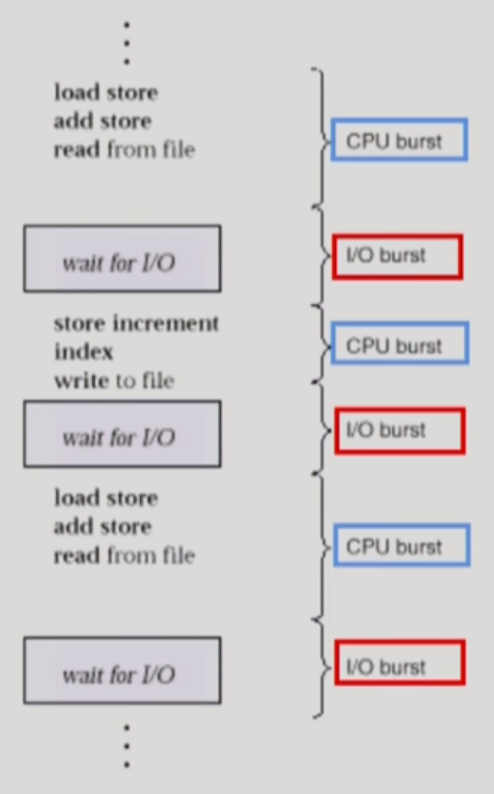

# 5. CPU 스케줄링

## CPU and I/O Bursts in Program Execution

## CPU-burst Time의 분포

## 프로세스의 특성 분류

- 프로세스는 그 특성에 따라 다음 두 가지로 나눔
  
  - I/O-bound process
    
    - CPU를 잡고 계산하는 시간보다 I/O에 많은 시간이 필요한 job
    
    - (many short CPU bursts)
  
  - CPU-bound process
    
    - 계산 위주의 job
    
    - (few very long CPU bursts)

## CPU Scheduler & Dispatcher

(둘 다 운영체제 안에 있는 코드이다...)

- CPU Scheduler
  
  - Ready 상태의 프로세스 중에서 이번에 CPU를 줄 프로세스를 고른다

- Dispatcher
  
  - CPU의 제어권을 CPU scheduler에 의해 선택된 프로세스에게 넘긴다
  
  - 이 과정을 context switch(문맥 교환)라고 한다

- CPU 스케줄링이 필요한 경우는 프로세스에게 다음과 같은 상태 변화가 있는 경우이다
  
  1. Running -> Blocked (예: I/O 요청하는 시스템 콜)
  
  2. Running -> Ready (예: 할당시간 만료로 timer interrupt)
  
  3. Blocked -> Ready (예: I/O 완료 후 인터럽트)
  
  4. Terminate

- 1, 4에서의 스케줄링은 nonpreemptive (=강제로 빼앗지 않고 자진 반납)

- All other scheduling is preemptive (=강제로 빼앗음)

