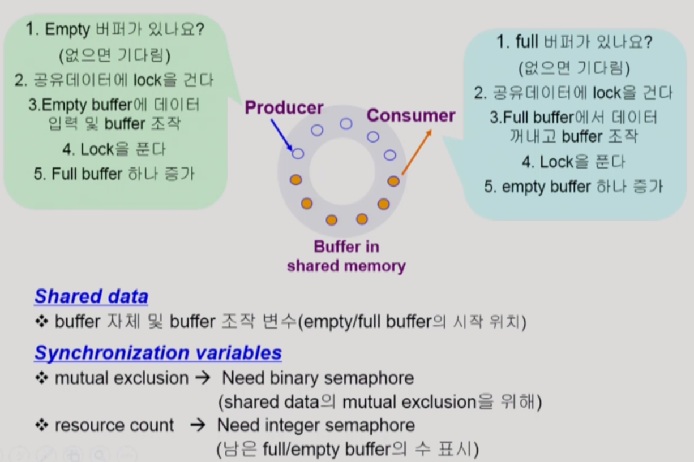
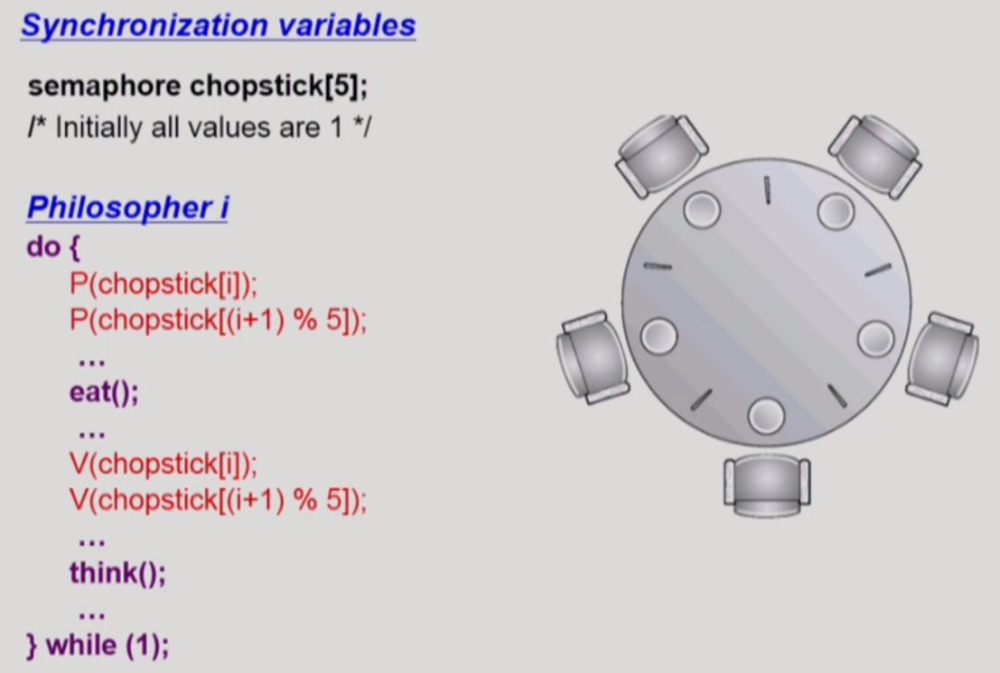

# 6. 프로세스 동기화

## 데이터의 접근


## Race Condition


(한 데이터를 동시에 두 군데에서 접근하면 synchronization의 문제가 생길 수 있음)

## OS에서 race condition은 언제 발생하는가?

1. kernel 수행 중 인터럽트 발생 시

2. Process가 system call을 하여 kernel mode로 수행 중인데 context switch가 일어나는 경우

3. Multiprocessor에서 shared memory 내의 kernel data 


(작업이 끝날 때까지는 인터럽트 처리를 하지 않음으로 해결)


(커널 모드 수행 중일 때는 CPU를 선점당하지 않는 것으로 해결)


(한 번에 한 CPU만 허용하게 하거나, 데이터를 lock하는 방법으로 해결)

## Process Synchronization 문제

- 공유 데이터(shared data)의 동시 접근(concurrent access)은 데이터의 불일치 문제(inconsistency)를 발생시킬 수 있다

- 일관성(consistency) 유지를 위해서는 협력 프로세스(cooperating process) 간의 실행 순서(orderly execution)를 정해주는 메커니즘 필요

- Race condition
  
  - 여러 프로세스들이 동시에 공유 데이터를 접근하는 상황
  
  - 데이터의 최종 연산 결과는 마지막에 그 데이터를 다룬 프로세스에 따라 달라짐

- race condition을 막기 위해서는 concurrent process는 동기화(synchronize)되어야 한다

## The Critical-Section Problem

- n 개의 프로세스가 공유 데이터를 동시에 사용하기를 원하는 경우

- 각 프로세스의 code segment에는 공유 데이터를 접근하는 코드인 critical section이 존재

- Problem
  
  - 하나의 프로세스가 critical section에 있을 때 다른 모든 프로세스는 critical section에 들어갈 수 없어야 한다

---

## 프로그램적 해결법의 충족 요건

- Mutual Exclusion (상호 배제)
  
  - 프로세스  Pi가 critical section 부분을 수행 중이면 다른 모든 프로세스들은 그들의 critical section에 들어가면 안된다

- Progress (진행)
  
  - 아무도 critical section에 있지 않은 상태에서 critical section에 들어가고자 하는 프로세스가 있으면 critical section에 들어가게 해주어야 한다

- Bounded Waiting (유한 대기)
  
  - 프로세스가 critical section에 들어가려고 요청을 한 후부터 그 요청이 허용될 때까지 다른 프로세스들이 critical section에 들어가는 횟수에 한계가 있어야 한다

- 가정
  
  - 모든 프로세스의 수행 속도는 0보다 크다
  
  - 프로세스들 간의 상대적인 수행 속도는 가정하지 않는다

## Initial Attempts to Solve Problem

- 두 개의 프로세스가 있다고 가정

- 프로세스들의 일반적인 구조
  
  ```java
  do {
      entry section
      critical section
      exit section
      remainder section
  } while(1);
  ```

- 프로세스들은 수행의 동기화(synchronize)를 위해 몇몇 변수를 공유할 수 있다 -> synchronization variable

## Algorithm 1

- Synchronization variable
  
  int turn;
  
  initially turn = 0;

- Process P0
  
  ```java
  do {
      while(turn != 0)    /* My turn? */
      critical section
      turn = 1            /* Now it's my turn */
      remainder section
  } while(1)
  ```

- Process P1 는 반대로 turn이 1일 때만 일함.

- Satisfies mutual exclusion, but not progress

- 즉, 과잉양보: 반드시 한 번씩 교대로 들어가야만 함(swap-turn). 그가 turn 을 내 값으로 바꿔줘야만 내가 들어갈 수 있음. 특정 프로세스가 더 빈번히 critical section을 들어가야 한다면?

## Algorithm 2

- Synchronization variable
  
  ```java
  boolean flag[2];
  initially flag[모두] = false; /* No one is in CS */
  ```
  
  Pi ready to enter its critical section if (flag[i] == true)

- Process Pi
  
  ```java
  do {
      flag[i] = true;    /* Pretend I am in */
      while(flag[j]);    /* Is he also in? then wait */
      critical section
      flag[i] = false;   /* I am out now */
      remainder section
  } while(1);
  ```

- Satisfies mutual exclusion, but not progress requirement.

- 둘 다 2행까지 수행 후 끊임 없이 양보하는 상황 발생 가능

## Algorithm 3 (Peterson's Algorithm)

- Combined synchronization variables of algorithms 1 and 2.

- Process Pi
  
  ```java
  do {
      flag[i] = true;    /* My intention is to enter ... */
      turn = j;          /* Set to his turn */
      while(flag[j] && turn == j);    /* wait only if ... */
      critical section
      flag[i] = false;
      remainder section
  } while(1);
  ```

- Meets all three requirements; solves the critical section problem for two processes.

- Busy Waiting(=spin lock)! (계속 CPU와 memory를 쓰면서 wait)

## Synchronization Hardware

- 하드웨어적으로 Test & modify를 atomic하게 수행할 수 있도록 지원하는 경우 앞의 문제는 간단히 해결

- Mutual Exclusion with Test & Set
  
  - Synchronization variable:
    
    boolean lock = false;
  
  - Process Pi
    
    do {
    
    while (Test_and_Set(lock));
    
    critical section
    
    lock = false;
    
    remainder section
    
    }

---

## Semaphores

- 앞의 방식들을 추상화시킴

- Semaphore S
  
  - integer variable
  
  - 아래의 두 가지 atomic 연산에 의해서만 접근 가능
    
    - P(S) : (자원을 가져감)
      
      while(S<=0) do no-op;
      
      S--;
      
      - busy-wait 문제: 애초부터 자원(S)이 0이면 주어진 시간 동안 기다리기만 하다가 CPU를 빼앗김.
    
    - V(S) : (자원을 내놓음)
      
      S++;

## Critical Section of n Processes

- Synchronization variable
  
  - semaphore mutex; /* initially 1: 1개가 CS에 들어갈 수 있다. */

- Process Pi
  
  ```java
  do {
      P(mutex);    /* If positive, dec-&-enter, Otherwise, wait*/
      critical section
      V(mutex);    /* Increment semaphore */
      remainder section
  } while(1);
  ```
  
  busy-wait는 효율적이지 못함(= spin lock)
  
  Block & Wakeup 방식의 구현 (= sleep lock)

## Block / Wakeup Implementation

- Semaphore를 다음과 같이 정의
  
  ```c
  typedef struct
  {
      int value;            /* semaphore */
      struct process *L;    /* process wait queue */
  } semaphore;
  ```

- block과 wakeup을 다음과 같이 가정
  
  - block
    
    - 커널은 block을 호출한 프로세스를 suspend시킴. 이 프로세스의 PCB를 semaphore에 대한 wait queue에 넣음.
  
  - wakeup(P)
    
    - block된 프로세스 P를 wakeup시킴. 이 프로세스의 PCB를 ready queue로 옮김.

## Implementation

block/wakeup version of P() & V()

- Semaphore 연산이 이제 다음과 같이 정의됨
  
  - P(S):
    
    ```c
    S.value--;        /* prepare to enter */
    if(S.value<0)    /* Oops, negative, I cannot enter */
    {
        add this process to S.L;
        block();
    }
    ```
  
  - V(S):
    
    ```c
    S.value++;
    if(S.value<=0)
    {
        remove a process P from S.L;
        wakeup(P);
    }
    ```
  
  - 여기서 S.value는 자원의 개수가 아니라, 음수라면 누군가가 자원을 기다리고 있다는 뜻이고, 양수라면 자원의 여분이 있기 때문에 기다리지 않고 쓰고 있는 상황이다라는 뜻. 즉, 누군가 깨워야될 것이 있는지 확인하기 위함.

## Which is better?

- Busy-wait v.s. Block/wakeup

- Block/wakeup overhead v.s. Critical section 길이
  
  - Critical section의 길이가 긴 경우 Block/wakeup이 적당
  
  - Critical section의 길이가 매우 짧은 경우 Block/wakeup오버헤드가 오히려 더 클 수 있음.
  
  - 일반적으로는 Block/wakeup 방식이 더 좋음

## Two Types of Semaphores

- Counting semaphore
  
  - 도메인이 0 이상인 임의의 정수값
  
  - 주로 resource counting에 사용

- Binary semaphore (=mutex)
  
  - 0 또는 1 값만 가질 수 있는 semaphore
  
  - 주로 mutual exclusion (lock/unlock)에 사용

## Deadlock and Starvation

- Deadlock
  
  - 둘 이상의 프로세스가 서로 상대방에 의해 충족될 수 있는 event를 무한히 기다리는 현상

- Starvation
  
  - indefinite blocking. 프로세스가 suspend된 이유에 해당하는 세마포어 큐에서 빠져나갈 수 없는 현상

---

## Classical Problems of Synchronization

- Bounded-Buffer Problem (Producer-Consumer Problem)

- Readers and Writers Problem

- Dining-Philosophers Problem


### Bounded-Buffer Problem

(Producer-Consumer Problem)



- Synchronization variables
  
  - semaphore full = 0, empty = n, mutex = 1;

- Producer

```c
do {
    ...
    produce an item in x
    ...

    P(empty);
    P(mutex); /* buffer에 lock을 건다 */

    ...
    add x to buffer
    ...

    V(mutex);
    V(full);
} while(1);
```

- Consumer

```c
do {
    ...
    produce an item in x
    ...

    P(full);
    P(mutex); /* buffer에 lock을 건다 */

    ...
    add x to buffer
    ...

    V(mutex);
    V(empty);
} while(1);
```

## Readers-Writers Problem

- 한 process가 DB에 write중일 때 다른 process가 접근하면 안됨

- read는 동시에 여럿이 해도 됨

- solution
  
  - Writer가 DB에 접근 허가를 아직 얻지 못한 상태에서는 모든 대기중인 Reader들을 다 DB에 접근하게 해준다
  
  - Writer는 대기 중인 Reader가 하나도 없을 때 DB 접근이 허용된다
  
  - 일단 Writer가 DB에 접근 중이면 Reader들은 접근이 금지된다
  
  - Writer가 DB에서 빠져나가야만 Reader의 접근이 허용된다

- Shared data
  
  - DB 자체
  
  - readcount; /* 현재 DB에 접근 중인 Reader의 수 */

- Synchronization variable
  
  - mutex /* 공유 변수 readcount를 접근하는 코드(critical section)의 mutual exclusion 보장을 위해 사용*/
  
  - db /* Reader와 writer가 공유 DB 자체를 올바르게 접근하게 하는 역할 */

- Shared data
  
  - int readcount = 0;
    DB 자체;

- Synchronization variables
  
  - semaphore mutex = 1, db = 1;

- Writer
  
  ```c
  P(db);
  ...
  writing DB is performed
  ...
  V(db);
  ```
  
  - starvation 발생 가능! (reader가 lock을 걸었을 때 writer가 기다리게 되고, 그 상태로 reader만 계속 쌓인다면 writer는 작업 수행을 할 수 없게 된다.)

- Reader
  
  ```c
  P(mutex);    /* readcount라는 변수 자체에 대한 lock */
  readcount++;
  if (readcount == 1) P(db); /* block writer */
  V(mutex);        /* readers follow */
  
  ...
  reading DB is performed
  ...
  
  P(mutex);
  readcount--;
  if(readcount == 0) V(db); /* enable writer */
  V(mutex);
  ```

## Dining-Philosophers Problem



- 위 solution의 문제점
  
  - Deadlock의 문제점 (모두 동시에 배고파서 자신의 왼쪽 젓가락을 집어버린 경우, 다 무한대기한다)

- 해결 방안
  
  - 4명의 철학자만이 테이블에 동시에 앉을 수 있도록 한다
  
  - 젓가락을 두 개 모두 집을 수 있을 때에만 젓가락을 집을 수 있게 한다
  
  - 비대칭 (짝수(홀수) 철학자는 왼쪽(오른쪽) 젓가락부터 집도록)

## Monitor

- Semaphore의 문제점
  
  - 코딩하기 힘들다
  
  - 정확성(correctness)의 입증이 어렵다
  
  - 자발적 협력(voluntary cooperation)이 필요하다
  
  - 한 번의 실수가 모든 시스템에 치명적 영향

- 예
  
  - V(mutex) -> Critical section -> P(mutex)
    
    - Mutual exclusion 깨짐
  
  - P(mutex) -> Critical section -> P(mutex)
    
    - Deadlock

- 동시 수행중인 프로세스 사이에서 abstract data type의 안전한 공유를 보장하기 위한 high-level synchronization construct
  
  - 모든 공유 데이터와, 이를 접근하는 프로시저를 모니터 내부에 정의한다. (공유 데이터 접근은 이 모니터 내부 프로시저로만 가능하고, 동시 실행이 안된다.)
  
  - semaphore와 달리 LOCK을 걸 필요가 없다!

- 프로그래머가 동기화 제약 조건을 명시적으로 코딩할 필요 없음

- 프로세스가 모니터 안에서 기다릴 수 있도록 하기 위해 condition variable 사용 (condition x, y;)

- Condition variable은 wait와 signal 연산에 의해서만 접근 가능
  
  - x.wait();
    
    - x.wait()을 invoke한 프로세스는 다른 프로세스가 x.signal()을 invoke하기 전까지 다 suspend된다.
  
  - x.signal();
    
    - x.signal()은 정확하게 하나의 suspend된 프로세스를 resume한다. Suspend된 프로세스가 없으면 아무 일도 일어나지 않는다.
