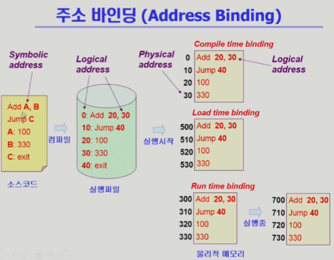
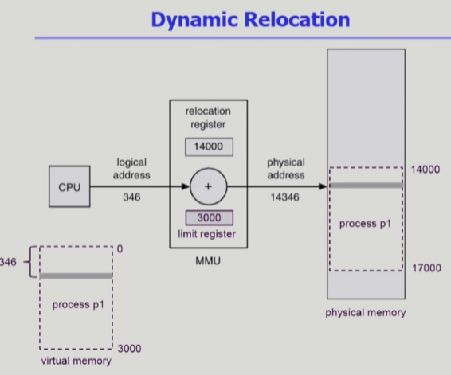

# 8. 메모리 관리

## Logical vs. Physical Address

- Logical address (=virtual address)
  
  - 프로세스마다 독립적으로 가지는 주소 공간
  
  - 각 프로세스마다 0번지부터 시작
  
  - CPU가 보는 주소는 logical address임

- Physical address
  
  - 메모리에 실제 올라가는 위치

- 주소 바인딩: 주소를 결정하는 것
  
  - Symbolic Address -> Logical Address "->" Physical Adress ("->"시점이 언제인가?)

## 주소 바인딩 (Address Binding)

1. Compile time binding
- 물리적 메모리 주소(physical address)가 컴파일 시 알려짐

- 시작 위치 변경시 재컴파일

- 컴파일러는 절대 코드(absolute code) 생성
2. Load time binding
- Loader의 책임하에 물리적 메모리 주소 부여

- 컴파일러가 재배치가능코드(relocatable code)를 생성한 경우 가능
3. Execution time binding (=Run time binding)
- 수행이 시작된 이후에도 프로세스의 메모리 상 위치를 옮길 수 있음

- CPU가 주소를 참조할 때마다 binding을 점검 (address mapping table)

- 하드웨어적인 지원이 필요 (e.g., base and limit registers, MMU)

(1. Compile time binding은 컴파일 할 때 이미 물리적 주소까지도 지정을 해놓는 방식. 비효율적이라 지금은 쓰지 않음.)

(2. Load time binding은 컴파일 할 때 논리적 주소만 정하고, 메모리에 올라갈 때 물리적 주소를 결정.)

(3. Run time binding은 실행시 주소가 결정되는 것은 같지만, 실행 도중에도 바뀔 수 있다. 지금 사용하는 방식.)

## Memory-Management Unit (MMU)

(현재 Run time binding 방식을 사용하는데, 컴파일된 실행파일은 항상 Physical이 아닌 Logical address를 가지고 있기 때문에, MMU는 L.a.로 P.a.를 알수 있게 하는 하드웨어 자원)

- MMU (Memory-Management Unit)
  
  - logical address를 physical address로 매핑해주는 Hardware device

- MMU scheme
  
  - 사용자 프로세스가 CPU에서 수행되며 생성해내는 모든 주소값에 대해 base register(=relocation register)의 값을 더한다

- user program
  
  - logical address만을 다룬다
  
  - 실제 physical address를 볼 수 없으며 알 필요가 없다

limit register의 값보다 큰 요청이라면, trap(software interrupt)을 발생시켜 운영체제에게 CPU 제어권을 넘기게 됨.
