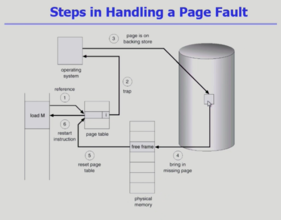
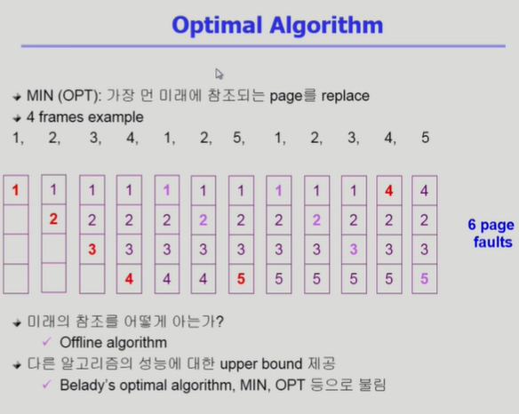
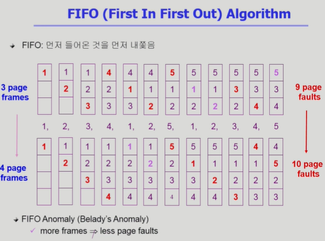
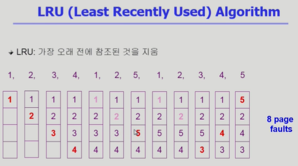
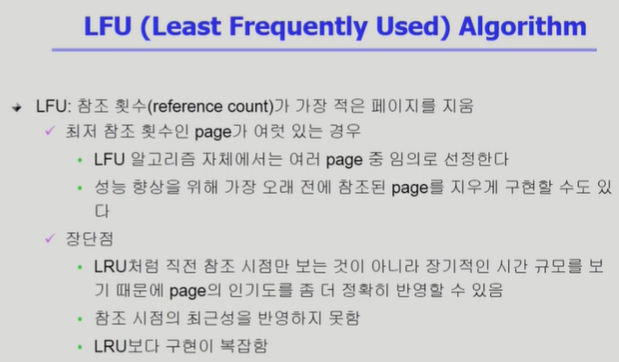
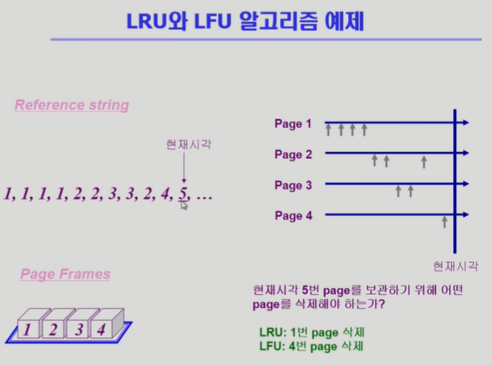
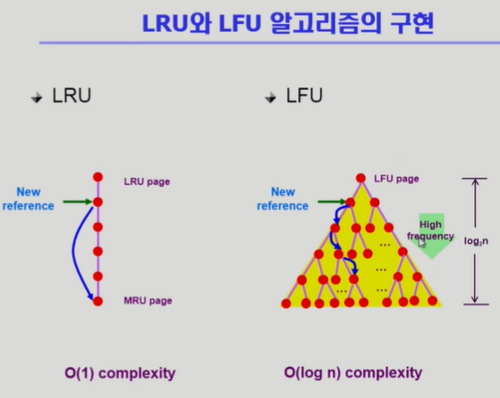
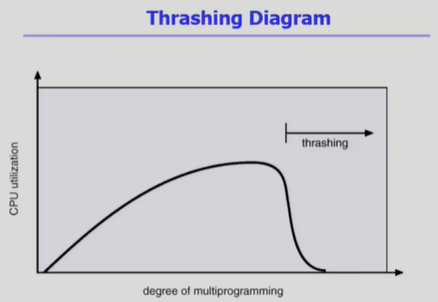
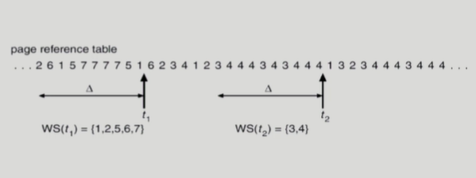
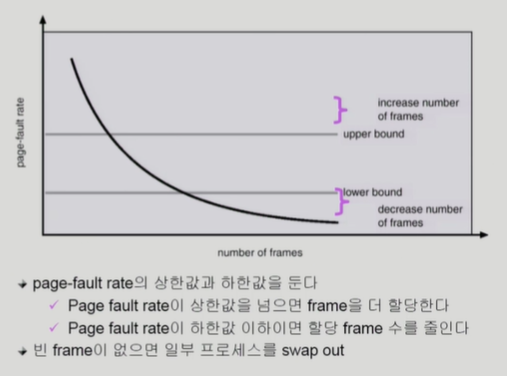

# 9. 가상 메모리

## Demand Paging

- 실제로 필요할 때 page를 메모리에 올리는 것
  
  - I/O 양의 감소
  
  - Memory 사용량 감소
  
  - 빠른 응답 시간
  
  - 더 많은 사용자 수용

- Valid/Invalid bit의 사용
  
  - Invalid의 의미
    
    - 사용되지 않는 주소 영역인 경우
    
    - 페이지가 물리적 메모리에 없는 경우
  
  - 처음에는 모든 page entry가 invalid로 초기화
  
  - address translation시에 invalid bit이 set되어 있으면 => "page fault"

## Page Fault

- invalid page를 접근하면 MMU가 trap을 발생시킴->OS에게 CPU를 넘김 (page fault trap)

- Kernel mode로 들어가서 page fault handler가 invoke됨

- 다음과 같은 순서로 page fault를 처리한다
  
  1. Invalid reference? (eg. bad address, protection violation) => abort process.
  
  2. Get an empty page frame. (없으면 뺏어온다: replace)
  
  3. 해당 페이지를 disk에서 memory로 읽어온다
     
     1. disk I/O가 끝나기까지 이 프로세스는 CPU를 preempt 당함 (block)
     
     2. Disk read가 끝나면 page tables entry 기록, valid/invalid bit = "valid"
     
     3. ready queue에 process를 insert -> dispatch later
  
  4. 이 프로세스가 CPU를 잡고 다시 running
  
  5. 아까 중단되었던 instruction을 재개

## Performance of Demand Paging

- Page Fault Rate 0<=p<=1.0
  
  - if p = 0 no page faults
  
  - if p = 1, every reference is a fault

- Effective Access Time
  
  = (1-p) x memory access
  
  \+ p (OS & HW page fault overhead
  
    \+ [swap page out if needed ] 
  
    \+ swap page in + OS & HW restart overhead )

(1-p만큼은 memory access만 하면 되고, p만큼은 OS에게 CPU가 넘어가고 HW적으로 page fault를 처리한 다음에, 빈공간이 없다면 페이지 하나를 쫓아내야 하고, 그 자리에 disk에서 읽어온 page를 올려놔야 되고, 그 다음에 OS가 page table에 valid 표시해주고 나중에 CPU를 얻으면 restart하는거 까지의 overhead가 발생)

## Free frame이 없는 경우

- Page replacement
  
  - 어떤 frame을 빼앗아올지 결정해야 함
  
  - 곧바로 사용되지 않을 page를 쫓아내는 것이 좋음
  
  - 동일한 페이지가 여러 번 메모리에서 쫓겨났다가 다시 들어올 수 있음

- Replacement Algorithm
  
  - page-fault rate을 최소화하는 것이 목표 (위의 p값)
  
  - 알고리즘의 평가
    
    - 주어진 page reference string에 대해 page fault를 얼마나 내는지 조사
  
  - reference string의 예
    
    1, 2, 3, 4, 1, 2, 5, 1, 2, 3, 4, 5

(^ 위 Optimal Algorithm은 Offline algo로, 불가능함. (미래를 알아야 하기 때문) 그래서 upper bound를 제공하는 의미만 있다고 볼 수 있음.)

(^ 가능하지만, 아래 나와있듯이 frame이 많아져도 성능이 꼭 좋아진단 보장은 없음)

(^ FIFO와 다르게 참조된지 오래된 것을 지우기 때문에 더 나은 편)

(^ 얘는 좀 다르게, 참조 횟수 기준. 근데 그게 동일하다면 임의로 할 수도 있고, 아니면 그 중에서도 참조된지 가장 오래된 애를 선별할 수도 있음)

(LRU는 가장 참조된지 오래된 1을, LFU는 1이 오래되긴 했어도 자주 참조되니까 참조 횟수 1회인 4를 선택)

(LRU는 Linked List 형태로 구현하면 O(1)로 선택할 수 있고,

LFU는 Linked List로 하면 new reference가 자기 위치를 찾을 때 최악의 경우 O(n)이 걸림. 때문에 heap으로 구현하면 O(log n)까지 낮출 수 있음)

## 다양한 캐슁 환경

- 캐슁 기법
  
  - 한정된 빠른 공간(=캐쉬)에 요청된 데이터를 저장해 두었다가 후속 요청시 캐쉬로부터 직접 서비스하는 방식
  
  - paging system 외에도 cache memory, buffer caching, Web caching 등 다양한 분야에서 사용

- 캐쉬 운영의 시간 제약
  
  - 교체 알고리즘에서 삭제할 항목을 결정하는 일에 지나치게 많은 시간이 걸리는 경우 실제 시스템에서 사용할 수 없음
  
  - Buffer caching이나 Web caching의 경우
    
    - O(1)에서 O(log n) 정도까지 허용
  
  - Paging system인 경우
    
    - page fault인 경우에만 OS가 관여함
    
    - 페이지가 이미 메모리에 존재하는 경우 참조시각 등의 정보를 OS가 알 수 없음
    
    - O(1)인 LRU의 list 조작조차 불가능

## Clock Algorithm

- Clock algorithm
  
  - LRU의 근사(approximation) 알고리즘
  
  - 여러 명칭: Second chance algorithm, NUR(Not Used Recently) / NRU(Not Recently Used)
  
  - Reference bit을 사용해 교체 대상 페이지 선정 (circular list)
  
  - reference bit가 0인 것을 찾을 때까지 포인터를 하나씩 앞으로 이동
  
  - 포인터 이동 중에 reference bit 1은 모두 0으로 바꿈
  
  - Reference bit이 0인 것을 찾으면 그 페이지를 교체
  
  - 한 바퀴 되돌아와서도 (=second chance) 0이면 그 때에는 replace 당함
  
  - 자주 사용되는 페이지라면 second chance가 올 때 1

- Clock algorithm의 개선
  
  - reference bit과 modified bit (dirty bit)을 함께 사용
  
  - reference bit = 1 : 최근 참조된 페이지
  
  - modified bit = 1 : 최근 변경된 페이지 (I/O를 동반하는 페이지)

## Page Frame의 Allocation

- Allocation problem: 각 process에 얼마만큼의 page frame을 할당할 것인가?

- Allocation의 필요성
  
  - 메모리 참조 명령어 수행시 명령어, 데이터 등 여러 페이지 동시 참조
    
    - 명령어 수행을 위해 최소한 할당되어야 하는 frame의 수가 있음
  
  - Loop를 구성하는 page들은 한꺼번에 allocate 되는 것이 유리함
    
    - 최소한의 allocation이 없으면 매 loop마다 page fault

- Allocation Scheme
  
  - Equal allocation: 모든 프로세스에 똑같은 갯수 할당
  
  - Proportional allocation: 프로세스 크기에 비례하여 할당
  
  - Priority allocation: 프로세스의 priority에 따라 다르게 할당

## Global vs. Local Replacement

- Global replacement
  
  - Replace 시 다른 process에 할당된 frame을 빼앗아 올 수 있다
  
  - Process별 할당량을 조절하는 또 다른 방법임
  
  - FIFO, LRU, LFU 등의 알고리즘을 global replacement로 사용시에 해당
  
  - Working set, PFF 알고리즘 사용

- Local replacement
  
  - 자신에게 할당된 frame 내에서만 replacement
  
  - FIFO, LRU, LFU 등의 알고리즘을 process별로 운영 시

## Thrashing

(page frame 수가 너무 적으면 발생하는 문제)

- Thrashing
  
  - 프로세스의 원활한 수행에 필요한 최소한의 page frame 수를 할당 받지 못한 경우 발생
  
  - Page fault rate이 매우 높아짐
  
  - CPU utilization이 낮아짐
  
  - OS는 MPD(Multiprogramming degree)를 높여야 한다고 판단
  
  - 또 다른 프로세스가 시스템에 추가됨 (higher MPD)
  
  - 프로세스 당 할당된 frame의 수가 더욱 감소
  
  - 프로세스는 page의 swap in / swap out으로 매우 바쁨
  
  - 대부분의 시간에 CPU는 한가함
  
  - low throughput

(이를 해결하기 위해 아래)

## Working-Set Model

- Locality of reference
  
  - 프로세스는 특정 시간 동안 일정 장소만을 집중적으로 참조한다
  
  - 집중적으로 참조되는 해당 page들의 집합을 locality set이라 함

- Working-set Model
  
  - Locality에 기반하여 프로세스가 일정 시간 동안 원활하게 수행되기 위해 한꺼번에 메모리에 올라와 있어야 하는 page들의 집합을 Working Set이라 정의함
  
  - Working Set 모델에서는 process의 working set 전체가 메모리에 올라와있어야 수행되고 그렇지 않을 경우 모든 frame을 반납한 후 swap out (suspend)
  
  - Thrashing을 방지함
  
  - Multiprogramming degree를 결정함

## Working-Set Algorithm

- Working set의 결정
  
  - Working set window를 통해 알아냄
  
  - window size가 d인 경우
    
    - 시각 ti에서의 working set WS (ti)
      
      - Time interval [ti-d, ti] 사이에 참조된 서로 다른 페이지들의 집합
    
    - Working set에 속한 page는 메모리에 유지, 속하지 않은 것은 버림 (즉, 참조된 후 d시간 동안 해당 page를 메모리에 유지한 후 버림)

## PFF (Page-Fault Frequency) Scheme

## Page Size의 결정

- Page size를 감소시키면
  
  - 페이지 수 증가
  
  - 페이지 테이블 크기 증가
  
  - Internal fragmentation 감소
  
  - Disk transfer의 효율성 감소
    
    - Seek/rotation vs. transfer
  
  - 필요한 정보만 메모리에 올라와 메모리 이용이 효율적
    
    - Locality의 활용 측면에서는 좋지 안흥ㅁ

- Trend
  
  - Larger page size

